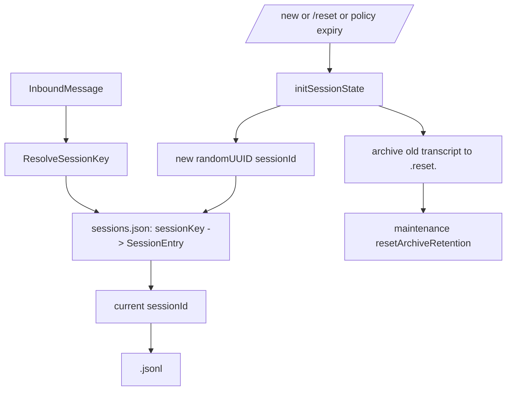
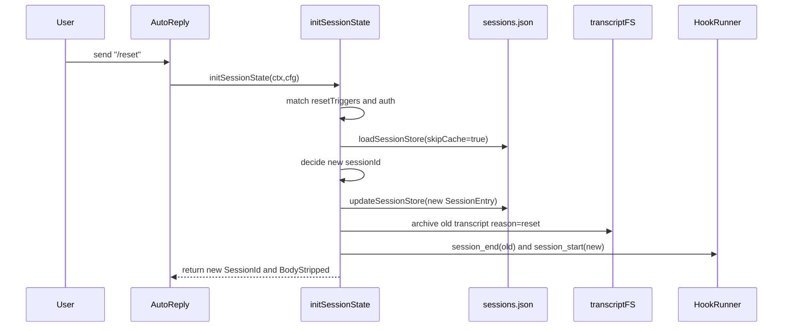

# OpenClaw 会话重置机制分析报告（面向 Agent-Diva）

> **版本**: v1.0  
> **日期**: 2026-03-03  
> **范围**: OpenClaw 会话架构 / reset 机制 / Gateway RPC / hooks / Agent-Diva 对比与迁移建议

---

## 1. 背景与目标

当前 `agent-diva` GUI 已保留“清空/删除聊天”按钮，但后端尚未形成真正的“会话重置”闭环（创建新会话 ID、归档旧 transcript、重置 token 统计、触发生命周期 hooks 等）。

本报告目标：

- 系统拆解 OpenClaw 的 session/reset 设计。
- 明确 `/new`、`/reset`、自动 reset、Gateway `sessions.reset` 的统一与差异。
- 对比 `agent-diva` 现状，给出可落地的迁移路径。

说明：本次分析优先基于 OpenClaw 官方文档与公开源码（当前工作区未发现本地 sibling `openclaw` 工程）。

---

## 2. OpenClaw 会话模型与持久化结构

### 2.1 模块入口

OpenClaw 将会话能力聚合在 `src/config/sessions.ts`，统一 re-export：

- `sessions/reset.ts`（重置策略）
- `sessions/store.ts`（store 读写、维护、归档清理）
- `sessions/session-key.ts`（sessionKey 规则）
- `sessions/transcript.ts`（transcript 路径与解析）
- 以及 `paths/types/session-file/delivery-info` 等

这一设计确保“会话键解析、重置策略、持久化、路由信息”位于同一抽象层，调用方（auto-reply、gateway、ui）无需重复实现。

### 2.2 两层持久化

OpenClaw 将会话状态拆分为两层：

1. **store（元信息层）**  
   `~/.openclaw/agents/<agentId>/sessions/sessions.json`  
   结构：`sessionKey -> SessionEntry`
2. **transcript（对话历史层）**  
   `~/.openclaw/agents/<agentId>/sessions/<sessionId>.jsonl`

核心含义：

- `sessionKey` 决定“哪一桶会话”。
- `sessionId` 指向当前正在写入的 transcript 文件。
- reset 的本质是：**同一个 sessionKey 切换到新的 sessionId**。

### 2.3 sessionKey 与 sessionId 的职责

- `sessionKey`: 业务会话路由键（direct/group/thread/cron/hook 等）。
- `sessionId`: 当前 transcript 的物理标识。
- reset 后：
  - `sessionKey` 通常不变（仍是当前聊天路由）。
  - `sessionId` 更新为新 UUID。
  - 旧 transcript 归档为 `.reset.` 系列文件。

### 2.4 结构图



---

## 3. 会话重置配置与策略

### 3.1 重置策略核心（`src/config/sessions/reset.ts`）

OpenClaw 在 `reset.ts` 中定义了重置的可组合策略：

- `mode`: `daily | idle`（文档与后续 PR 已扩展到 `off` 关闭自动重置）
- `atHour`: 每日重置基准小时（默认 4 点，本地时区）
- `idleMinutes`: 空闲窗口（滑动过期）

以及两个关键维度：

- `resetByType`: 按 `direct/group/thread` 覆盖
- `resetByChannel`: 按 channel 覆盖（优先级高于上层）

### 3.2 策略合并与兼容逻辑

`resolveSessionResetPolicy()` 的要点：

- 先取 channel override，再取 type override，再取全局 `session.reset`。
- 兼容旧配置 `session.idleMinutes`（仅配置旧字段时保持 idle-only 行为）。
- 对 `atHour` 做 0~23 归一化，对 `idleMinutes` 做最小值保护。

### 3.3 过期判定

`evaluateSessionFreshness()` 同时计算两种截止：

- `dailyResetAt`: 最近一个 daily 重置边界。
- `idleExpiresAt`: `updatedAt + idleMinutes`。

任一过期则判定 stale，需要新会话 ID。

### 3.4 配置示例（官方文档）

```json5
{
  session: {
    reset: { mode: "daily", atHour: 4, idleMinutes: 120 },
    resetByType: {
      thread: { mode: "daily", atHour: 4 },
      direct: { mode: "idle", idleMinutes: 240 },
      group: { mode: "idle", idleMinutes: 120 }
    },
    resetByChannel: {
      discord: { mode: "idle", idleMinutes: 10080 }
    },
    resetTriggers: ["/new", "/reset"]
  }
}
```

---

## 4. 手动重置命令流程（`/new` / `/reset`）

### 4.1 主入口

核心入口为 `src/auto-reply/reply/session.ts` 的 `initSessionState()`。

该函数同时处理：

- 命令触发重置（`/new`, `/reset`）
- 自动策略重置（daily/idle 到期）
- store 加载与写回
- transcript 归档
- hooks 触发

### 4.2 命令识别

在 `initSessionState()` 中：

- 会先对消息做结构前缀清理与 mention 清理（群聊场景）。
- `resetTriggers` 默认来自 `DEFAULT_RESET_TRIGGERS`（包含 `/new`、`/reset`）。
- 支持：
  - 完整匹配：`/reset`
  - 前缀匹配：`/new gpt-4`（保留剩余 body 给后续流程）
- 命令受授权校验保护（`resolveCommandAuthorization`）。

### 4.3 触发 reset 后的行为

`isNewSession = true` 时：

- 生成新 `sessionId`（`crypto.randomUUID()`）。
- 重置会话运行态：
  - `systemSent = false`
  - `abortedLastRun = false`
  - `compactionCount = 0`
  - 清空 token 统计（`input/output/total/context`）
- 可继承用户偏好：
  - `thinkingLevel`
  - `verboseLevel`
  - `reasoningLevel`
  - `ttsAuto`
  - `modelOverride/providerOverride`
  - `label`

这保证“重置上下文”与“保留用户行为偏好”兼得。

### 4.4 transcript 归档

reset 时若存在旧 `sessionId`，会调用 `archiveSessionTranscripts(...)`：

- 旧 transcript 不直接删，而是归档为 `.reset.` 工件。
- 后续由 `session.maintenance.resetArchiveRetention` 控制保留期清理。

### 4.5 手动重置时序图



---

## 5. 自动重置与 Gateway `sessions.reset`

### 5.1 自动重置（消息到达时判定）

自动重置不是后台定时强切，而是在“下一条入站消息”触发时判定 freshness：

- 若 `daily` 或 `idle` 失效，则在该消息处理前切新 `sessionId`。
- 若仍 fresh，则复用当前 `sessionId`。

### 5.2 Gateway RPC：`sessions.reset`

`src/gateway/server-methods/sessions.ts` 的 `sessions.reset` 提供程序化重置：

- 适用于 TUI/Web/UI/移动端等网关客户端。
- 主要步骤：
  1. 参数校验 + 解析目标 session key
  2. 执行 runtime cleanup（队列、子任务、嵌入式运行）
  3. 更新 store 为新 `sessionId`
  4. token 计数归零
  5. 归档旧 transcript
  6. 发出 session 生命周期解绑事件

### 5.3 `before_reset` hook 的现状

从公开 PR `#29969` 可见，社区已识别并修复 gateway 路径未触发 `before_reset` 插件 hook 的问题，目标是让 `sessions.reset` 与 auto-reply 路径的 reset hook 行为一致。

这意味着 OpenClaw 的重置能力正从“命令驱动”进一步走向“命令 + RPC 一致化”。

---

## 6. 插件扩展点（session_start/session_end/before_reset）

OpenClaw reset 相关扩展点主要有三类：

- `session_end`: 旧会话被替换时触发。
- `session_start`: 新会话启动时触发。
- `before_reset`: reset 前触发（尤其用于做 memory flush、状态快照、外部同步）。

设计价值：

- 将“重置前后副作用”从主流程抽离到插件层。
- 保持 reset 主路径最小闭环，减少业务分叉。
- 让不同客户端入口（命令、RPC、UI）共享一套生命周期语义。

---

## 7. 与 Agent-Diva 的对比分析

## 7.1 已有能力（Agent-Diva）

从当前代码看，`agent-diva` 已具备基础会话持久化与长期记忆能力：

- `agent-diva-core/src/session/manager.rs`
  - 会话文件 `sessions/<safe_key>.jsonl`
  - 支持 `get_or_create`、`save`、`delete`
- `agent-diva-core/src/session/store.rs`
  - `Session::clear()` 可清空消息数组（内存态）
- `agent-diva-core/src/memory/manager.rs`
  - `memory/MEMORY.md` 与 `memory/HISTORY.md` 持久化
- `agent-diva-agent/src/agent_loop.rs`
  - 按 `channel:chat_id` 组装会话 key，并在每轮结束后写盘

### 7.2 GUI 现状（删除按钮链路）

`agent-diva-gui` 中删除按钮链路目前是纯前端状态清空：

- `ChatView.vue` 点击 `Trash2` -> 触发 `emit('clear')`
- `NormalMode.vue` 透传 `@clear="emit('clear')"`
- `App.vue` 的 `clearMessages()` 仅重置本地 `messages` 数组为一条提示消息

未看到对应后端命令（`src-tauri/src/commands.rs` 无 `reset_session` / `clear_session` 命令）：

- 没有创建新 `sessionId`
- 没有删除或归档旧 session 文件
- 没有 token/统计复位
- 没有生命周期 hook

### 7.3 差异总结

- OpenClaw：重置是“会话状态机行为”（store+transcript+runtime+hooks）。
- Agent-Diva：当前 GUI 清空是“视图层行为”（仅前端消息列表）。

---

## 8. 设计要点与迁移建议（面向 Agent-Diva）

### 8.1 建议目标状态

为 `agent-diva` 建立统一的 `SessionInit/SessionReset` 层，保证所有入口（GUI、CLI、频道）行为一致：

1. 解析 reset 触发（命令或 API）
2. 计算 session key 对应当前 active session
3. 生成新 session 标识（建议显式 session_id，而非仅文件名推导）
4. 归档/删除旧 transcript（建议默认归档）
5. 复位会话统计字段
6. 触发 reset 生命周期事件（便于未来插件化）

### 8.2 配置建议（与 OpenClaw 对齐）

建议在 `agent-diva-core` 配置模型中预留：

- `session.reset`
  - `mode: daily | idle | off`
  - `at_hour`
  - `idle_minutes`
- `session.reset_by_type`
- `session.reset_by_channel`
- `session.reset_triggers`
- `session.maintenance.reset_archive_retention`

这样可先接入“手动 reset”，后续无缝扩展“自动 reset”。

### 8.3 GUI 对接建议

当前按钮应从“仅清空前端消息”升级为“调用后端 reset API”：

- 建议新增 Tauri command：`reset_session(chat_id, channel)`（命名可调整）
- command 调用后端 API 或本地核心逻辑，执行真实重置
- 前端收到成功响应后再刷新本地消息视图

### 8.4 渐进实施建议

建议分三步：

1. **Phase 1**：先打通 GUI -> 后端 reset 命令（手动重置）
2. **Phase 2**：引入归档与 retention 策略
3. **Phase 3**：引入自动 reset（daily/idle）与 hooks

---

## 9. 风险与注意事项

- **并发写风险**：重置与正常写会话并发时需保证锁粒度一致。
- **文件归档风险**：跨平台（尤其 Windows）文件 rename/锁行为要做重试与容错。
- **语义一致性风险**：GUI/CLI/channel 若走不同路径，会出现“看起来重置了但磁盘未重置”的错觉。
- **插件副作用风险**：`before_reset` 类 hook 应与主流程解耦，避免放大 reset 延迟。

---

## 10. 结论

OpenClaw 的“会话重置”并非单一按钮动作，而是一套完整的会话生命周期机制：

- 命令触发 + 策略触发统一到 `initSessionState`
- store 与 transcript 双层持久化协同
- reset 后新 `sessionId`、旧 transcript 归档、统计复位
- Gateway `sessions.reset` 提供程序化入口
- hooks 提供重置前后扩展点

对 `agent-diva` 来说，最关键的不是“新增一个清空按钮”，而是将 reset 从 UI 行为升级为核心会话语义。当前 GUI 删除按钮已经具备入口形态，下一步应优先补齐后端 reset 闭环。

---

## 参考来源

- OpenClaw 文档：`https://docs.openclaw.ai/concepts/session`
- OpenClaw 文档：`https://docs.openclaw.ai/reference/session-management-compaction`
- OpenClaw 源码：`src/config/sessions.ts`
- OpenClaw 源码：`src/config/sessions/reset.ts`
- OpenClaw 源码：`src/auto-reply/reply/session.ts`
- OpenClaw 源码：`src/gateway/server-methods/sessions.ts`
- OpenClaw 讨论：Issue `#10981`, `#18223`, PR `#29969`
- Agent-Diva 本地代码：
  - `agent-diva-core/src/session/manager.rs`
  - `agent-diva-core/src/session/store.rs`
  - `agent-diva-core/src/memory/manager.rs`
  - `agent-diva-agent/src/agent_loop.rs`
  - `agent-diva-gui/src/components/ChatView.vue`
  - `agent-diva-gui/src/components/NormalMode.vue`
  - `agent-diva-gui/src/App.vue`
  - `agent-diva-gui/src-tauri/src/commands.rs`

---

## 11. Agent-Diva 会话重置技术设计草案

本节将前文对 OpenClaw 的分析，落地为 `agent-diva` 的技术设计草案，聚焦最小可行闭环（MVP）：**GUI 删除按钮触发真实会话 reset**，并为后续扩展（自动 reset、hooks）预留空间。

### 11.1 设计目标

- **统一语义**：无论来源是 GUI、CLI 还是未来的频道 handler，“重置会话”都走同一条后端逻辑。
- **可观测**：重置后可以从日志和持久化数据中清楚看到新旧会话的切换。
- **可扩展**：后续引入自动 reset、会话级 hooks 时，不需要再破坏现有接口。

### 11.2 核心抽象：SessionResetService（建议）

在 `agent-diva-core` 中新增一个服务层，封装会话重置相关操作：

- 输入：
  - `session_key: String`（目前为 `"{channel}:{chat_id}"`）
  - 可选 `reason: String`（如 `"manual-gui"`, `"manual-cli"`, `"auto-idle"`, `"auto-daily"`）
- 输出：
  - 新建的会话标识（可选）：例如新生成的 `session_key` 或显式 `session_id`
  - 重置结果状态（成功/失败 + 错误信息）
- 职责：
  - 定位旧会话文件（JSONL）
  - 归档/删除旧文件
  - 建立新会话记录（可通过新文件或清空旧文件实现）
  - 触发后续 hooks（目前可以是简单的日志事件）

由于当前 `SessionManager` 已经负责：

- `get_or_create(key)` -> `Session`
- `save(session)` -> 写 JSONL
- `delete(key)` -> 删除 JSONL 文件

MVP 实现可以采用**“归档 + 重建”**的简单策略：

1. 通过 `SessionManager::get(key)` 判断是否存在 session。
2. 若存在：
   - 计算旧路径 `session_path(key)`。
   - 将旧文件重命名为 `"{safe_key}.reset.{timestamp}.jsonl"`。
3. 创建新会话：
   - `Session::new(key)` -> `SessionManager::save(&session)`。

这样在不改动 `Session` 结构的前提下，完成“历史隔离 + 新会话起点”的行为。

### 11.3 GUI -> Tauri 命令 -> 后端链路

#### 11.3.1 前端改动（Vue）

- 在 `ChatView.vue` 的删除按钮点击逻辑中：
  - 目前：仅 `emit('clear')`，上层 `App.vue::clearMessages()` 只清理本地 `messages`。
  - 调整为：
    - 仍然触发 `emit('clear')`（用于即时清 UI），
    - 同时在上层触发 Tauri 命令（例如 `invoke("reset_session", { channel, chatId })`），等待后端返回结果。

前端调用所需参数：

- `channel`: 当前对话所属渠道（MVP 可先固定为 `"gui"` 或 `"cli"`，后续接入真实值）。
- `chat_id`: 当前对话唯一标识（MVP 可使用单一对话 ID，如 `"main"` 或某个 UUID）。

#### 11.3.2 Tauri 命令设计（`src-tauri/src/commands.rs`）

建议新增命令：

```rust
#[tauri::command]
pub async fn reset_session(
    channel: Option<String>,
    chat_id: Option<String>,
    state: State<'_, AgentState>,
) -> Result<(), String> {
    // 1. 解析 session_key（与后端 AgentLoop 保持一致）
    //    例如：let key = format!("{}:{}", channel.unwrap_or("gui".into()), chat_id.unwrap_or("main".into()));
    // 2. 调用后端 HTTP API 或直接调用本地会话重置逻辑（视 gateway/本地模式而定）
    // 3. 返回 Ok 或 Err(String)
}
```

对接方式有两种：

- **方式 A：通过 HTTP 调用 gateway API**  
  如果 `agent-diva` 最终会有 HTTP API（类似 OpenClaw Gateway），可以在后端实现一个 `POST /sessions/reset`，由该命令转发。
- **方式 B：本地直接操作 workspace**  
  在 Tauri 侧直接复用 `agent-diva-core` 的 `SessionManager`，对当前 workspace 下的 `sessions/*.jsonl` 做归档与重建。

MVP 阶段建议选择方式 B（本地操作），因为：

- 改动半径更小，不依赖外部进程；
|- 与当前 GUI 的 `AgentState`（只关注模型配置与 tools）边界清晰。

### 11.4 后端会话重置具体流程（本地模式草案）

以下假设在某个后端服务（例如未来的 `agent-diva-manager` 或 CLI 后台）中引入 `SessionResetService`：

1. **解析会话键**
   - 与 `AgentLoop` 一致：`session_key = format!("{}:{}", channel, chat_id)`。
2. **归档旧会话文件**
   - 调用 `SessionManager::get(&session_key)` 检查存在。
   - 若存在：通过内部 `session_path(&session_key)` 拿到文件路径。
   - 将该文件重命名为：
     - `"{safe_key}.reset.{timestamp}.jsonl"`
   - 可选：记录归档事件到日志或未来的 `sessions.json` 元信息。
3. **创建新会话**
   - `let mut session = Session::new(&session_key);`
   - 可根据需要：
     - 写入一条 system 提示（例如“会话已重置，从此开始新的对话”）。
   - `SessionManager::save(&session)`。
4. **返回结果**
   - 若以上操作成功，返回 `Ok(())`。
   - 若失败，返回错误字符串供前端展示（system 消息）。

### 11.5 与 AgentLoop 的集成考虑

当前 `AgentLoop::process_inbound_message_inner` 中，在每轮末尾：

- 基于 `channel:chat_id` 从 `SessionManager` 加载会话；
- 追加新的 turn；
- 持久化；
- 跑 memory consolidation。

加入 reset 后需要确保：

- 若用户在 GUI 中点击 reset，再发送下一条消息：
  - `SessionManager::get_or_create` 将读到“新文件”（旧文件已归档）。
  - 历史上下文（JSONL 内容）自然被隔离。
- 若未来引入自动 reset：
  - 可以在 `process_inbound_message_inner` 入口处增加“会话是否过期”的判定；
  - 过期时调用与 GUI 相同的 reset 流程（避免两套实现）。

### 11.6 未来扩展位（自动 reset 与 hooks）

在上述 MVP 完成后，可逐步加入以下特性：

- **自动 reset 策略**  
  在 `agent-diva` 自身 config 中引入：
  - `session.reset.mode: "off" | "daily" | "idle"`
  - `session.reset.at_hour: u8`
  - `session.reset.idle_minutes: u32`
- **简单 hooks 机制**  
  在重置前后发出内部事件（例如通过 `tracing` 或自定义事件总线）：
  - `SessionEvent::BeforeReset { session_key, reason }`
  - `SessionEvent::AfterReset { session_key, reason }`
- **长期目标：对齐 OpenClaw 的 SessionInit 模式**  
  引入一个 Rust 版的“会话初始化器”，统一处理：
  - reset 触发解析（未来的 `/new`、`/reset` 命令）；
  - 配置驱动的自动 reset；
  - 会话元信息维护（若以后引入 `sessions.json` 风格的 store）。

### 11.7 实施优先级建议

- **P0（当前迭代可完成）**
  - Tauri 新增 `reset_session` 命令（仅本地模式）。
  - 在该命令中基于 `SessionManager` 实现“归档旧文件 + 新建会话”逻辑。
  - GUI 删除按钮调用该命令，并在成功后清空本地 `messages`。
- **P1（下一步）**
  - 将 reset 能力抽象为 `SessionResetService`，CLI/未来 HTTP 接口共享。
  - 增加简单事件 hooks（Before/AfterReset）。
- **P2（中期）**
  - 引入自动 reset 配置与策略判定（对齐 OpenClaw `reset`/`resetByType` 的简化子集）。
  - 若需要大规模会话管理，再考虑引入 `sessions.json` 风格 store。

## 12. `/stop` 命令语义补充（stop-only）

在 `reset` 之外，建议明确引入独立的 `stop-only` 控制语义，并与 OpenClaw 的会话生命周期思想保持兼容：

- `/stop` 的行为：**仅终止当前正在进行的一次生成/工具链执行**。
- `/stop` 不做的事情：
  - 不清空会话历史；
  - 不创建新 session_id；
  - 不触发 reset 归档逻辑。
- `/stop` 与 `/new`、`/reset` 的边界：
  - `/stop`：中断当前轮执行，下一条消息仍延续同一会话历史；
  - `/new` / `/reset`：切换到新会话上下文（或等价重置语义），旧历史隔离/归档。

推荐所有入口统一支持 `/stop` 文本命令（GUI、CLI/TUI、API、渠道消息），并统一收敛到运行时控制命令（如 `StopSession { session_key }`），避免各入口出现不同中断语义。

