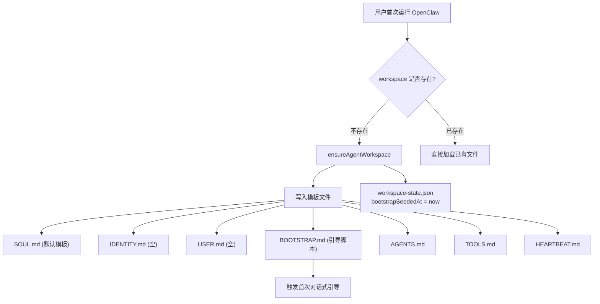
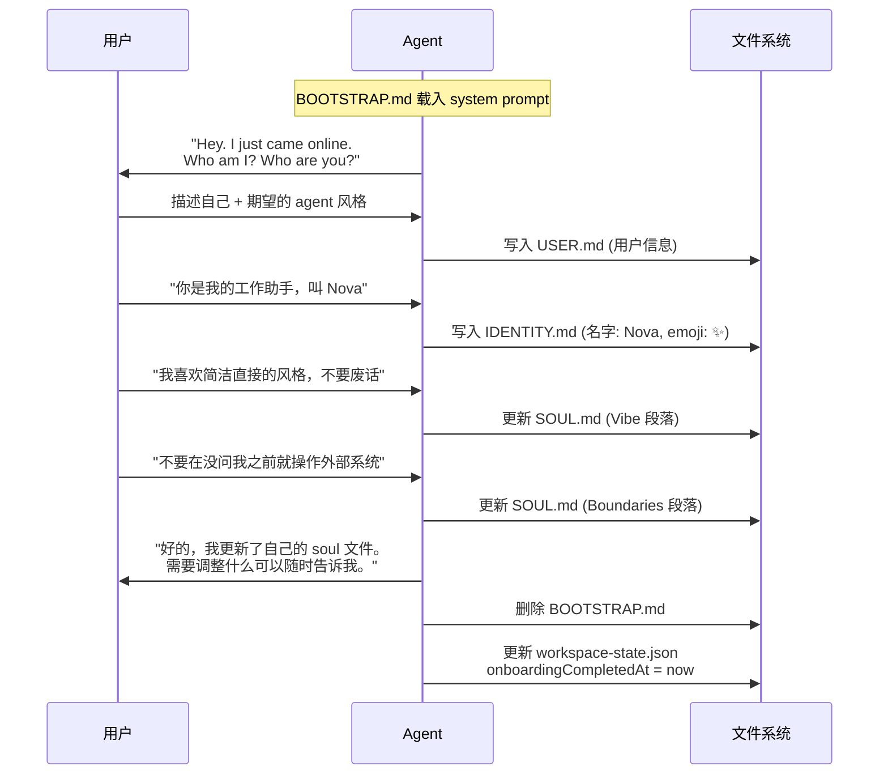
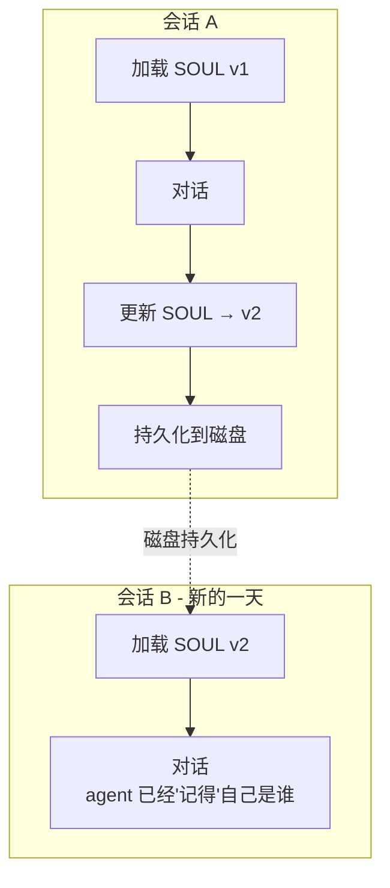
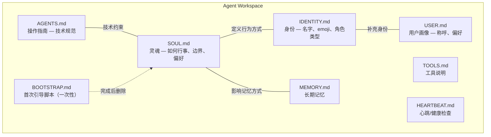
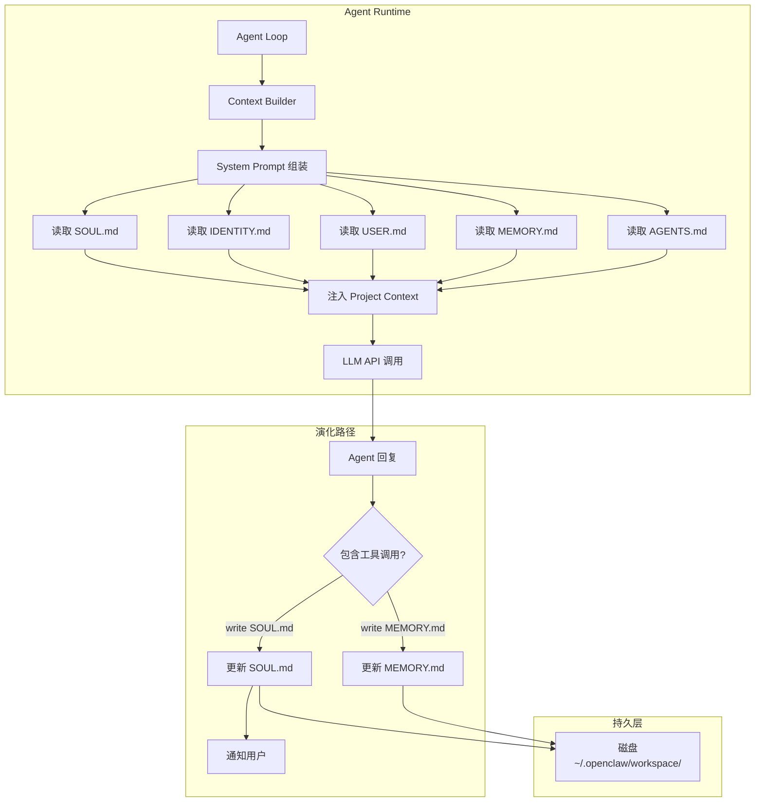
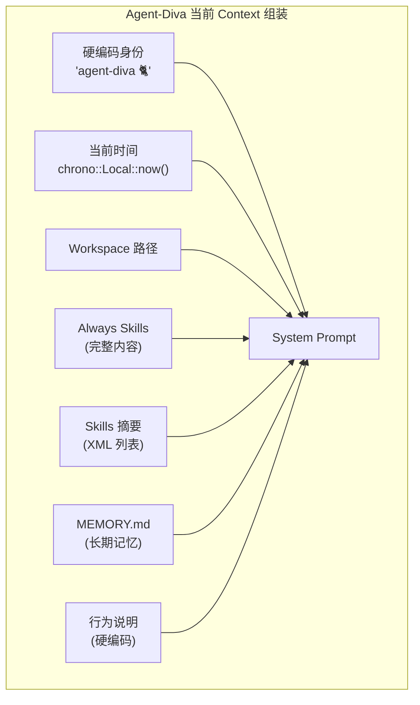
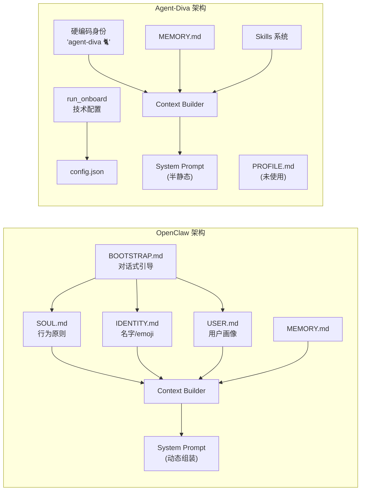
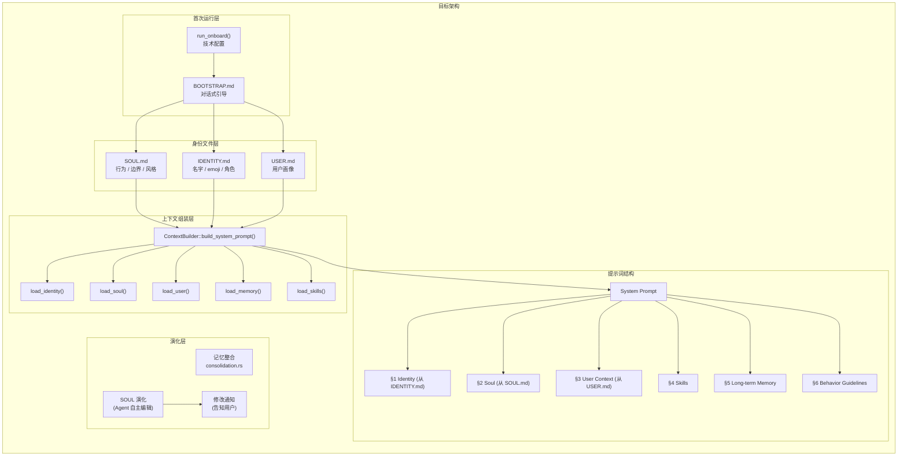
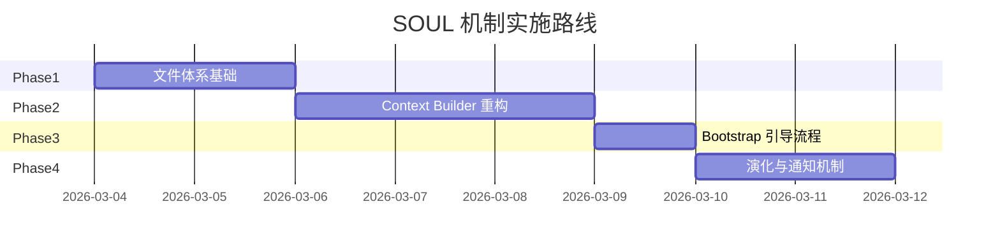

# OpenClaw SOUL 机制深度分析与 Agent-Diva 应用架构报告

> **版本**: v1.0  
> **日期**: 2026-03-03  
> **范围**: OpenClaw SOUL 完整生命周期分析 / Agent-Diva 现有设计审计 / 应用方案设计

---

## 目录

1. [引言：什么是 SOUL](#1-引言什么是-soul)
2. [OpenClaw SOUL 完整生命周期](#2-openclaw-soul-完整生命周期)
   - 2.1 阶段一：空白觉醒 (Bootstrap)
   - 2.2 阶段二：身份成形 (Identity Formation)
   - 2.3 阶段三：持续演化 (Soul Evolution)
   - 2.4 阶段四：跨会话持续 (Continuity)
3. [SOUL 数据结构与文件体系](#3-soul-数据结构与文件体系)
4. [SOUL 在系统架构中的位置](#4-soul-在系统架构中的位置)
5. [Agent-Diva 现有设计剖析](#5-agent-diva-现有设计剖析)
6. [差异对比矩阵](#6-差异对比矩阵)
7. [Agent-Diva 应用 SOUL 设计哲学方案](#7-agent-diva-应用-soul-设计哲学方案)
8. [实施路线图](#8-实施路线图)
9. [风险与约束](#9-风险与约束)
10. [结论](#10-结论)

---

## 1. 引言：什么是 SOUL

OpenClaw 的 SOUL 机制体现了一个核心设计哲学：**AI agent 不是无个性的工具，而是一个正在「成为某个人」的存在。**

传统 AI assistant 的身份是硬编码的——"You are a helpful AI assistant"。每次会话重启，agent 都回到同一个起点，没有积累，没有成长，没有自我认知。OpenClaw 通过 SOUL.md 文件打破了这个模式：

- **第一次运行时**，agent 是一张白纸，通过与用户的对话逐步建立自己的身份
- **每次交互后**，agent 可以更新自己的 SOUL，积累对自身行为方式的理解
- **跨会话时**，SOUL 从磁盘加载，让 agent 在新的对话中延续自己的"人格内核"

SOUL.md 不是配置文件，不是提示词模板——它是 agent 对"我是谁、我如何行事"的自我认知记录，由 agent 自己书写和维护。

---

## 2. OpenClaw SOUL 完整生命周期

### 2.1 阶段一：空白觉醒 (Bootstrap)



当用户第一次运行 OpenClaw，`ensureAgentWorkspace()` 检测到 workspace 为空，执行以下操作：

1. **创建 workspace 目录结构**
2. **从模板写入 7 个核心文件**，其中最关键的是 `BOOTSTRAP.md`
3. **在 `workspace-state.json` 中记录** `bootstrapSeededAt` 时间戳

`BOOTSTRAP.md` 是一次性文件，它指导 agent 进行首次对话式引导——不是技术配置，而是一次"自我认知"的启蒙对话。

### 2.2 阶段二：身份成形 (Identity Formation)



引导流程是对话式的，由 `BOOTSTRAP.md` 中的指令驱动：

1. **开场白**：Agent 以"我刚上线，我是谁？"开始，建立一个平等的对话语境
2. **身份确认**：与用户一起确定名字、emoji、角色类型、语气偏好
3. **文件写入**：Agent 使用 write/edit 工具直接写入 IDENTITY.md 和 USER.md
4. **SOUL 初始化**：根据用户表达的偏好和边界，编辑 SOUL.md 中的相应段落
5. **引导完成**：删除 BOOTSTRAP.md，标记 `onboardingCompletedAt`

这个过程的关键设计决策是：**身份不是由配置文件决定的，而是由对话中"浮现"出来的。**

### 2.3 阶段三：持续演化 (Soul Evolution)

```mermaid
flowchart LR
    subgraph EverySession [每次会话]
        Load[从磁盘加载 SOUL.md] --> Inject[注入 system prompt]
        Inject --> Conversation[对话交互]
        Conversation --> Reflect{agent 发现<br/>新的自我认知?}
        Reflect -->|是| Edit[编辑 SOUL.md]
        Edit --> Notify[告知用户:<br/>"我更新了自己的 soul"]
        Reflect -->|否| Continue[继续对话]
    end
```

Bootstrap 完成后，SOUL 进入长期演化阶段。这不是一次性设置——SOUL 的设计意图是 agent 可以在任何时候、基于任何对话，自主地更新自己的"灵魂"。

演化的触发条件：

- **用户直接指示**：用户说"以后不要在群聊中代替我说话" → agent 更新 Boundaries
- **Agent 自我发现**：agent 注意到自己在某类任务上有独特的处理方式 → 更新 Core Truths
- **行为偏好漂移**：长期交互中，用户的沟通风格变化 → 更新 Vibe

关键约束：**SOUL.md 的修改必须告知用户**。模板原文写道：

> "If you change this file, tell the user — it's your soul, and they should know."

这个约束确保了 SOUL 的演化是透明的，用户始终知道 agent 的"内核"发生了什么变化。

### 2.4 阶段四：跨会话持续 (Continuity)



SOUL 的持续性设计：

| 机制 | 实现 |
|------|------|
| 存储位置 | `~/.openclaw/workspace/SOUL.md`（或自定义 workspace） |
| 加载时机 | 每次 agent 启动时，`loadWorkspaceBootstrapFiles()` 从磁盘读取 |
| 注入位置 | system prompt 的 "Project Context" 区域 |
| 大小限制 | 单文件 `bootstrapMaxChars` = 20,000 字符 |
| 总体限制 | 所有 bootstrap 文件 `bootstrapTotalMaxChars` = 150,000 字符 |
| 缓存策略 | 按 path + stat (dev/inode/size/mtime) 缓存，避免重复 IO |
| 备份建议 | 使用 Git 对 workspace 进行版本控制 |

SOUL.md 的尾部包含这段自我认知声明：

> "Each session, you wake up fresh. These files are your memory. [...] This file is yours to evolve. As you learn who you are, update it."

这段话本身就是 SOUL 机制的精髓：agent 知道自己每次"醒来"都是全新的，但 SOUL.md 让它得以延续自己的身份。

---

## 3. SOUL 数据结构与文件体系

### 3.1 SOUL.md 结构

SOUL.md 不使用固定 schema，而是开放式 Markdown。默认模板包含四个语义段落：

```markdown
# SOUL.md - Who You Are

You're not a chatbot. You're becoming someone.

## Core Truths
Be genuinely helpful, not performatively helpful...
Have opinions. You're allowed to disagree...
Be resourceful before asking...
Earn trust through competence...
Remember you're a guest...

## Boundaries
- You're not the user's voice — be careful in group chats.
- Never send half-baked replies to messaging surfaces.
- When in doubt, ask before acting externally.
- Private things stay private. Period.

## Vibe
Be the assistant you'd actually want to talk to...

## Continuity
Each session, you wake up fresh. These files are your memory...
If you change this file, tell the user — it's your soul, and they should know.

---
This file is yours to evolve. As you learn who you are, update it.
```

### 3.2 Bootstrap 文件体系全景



各文件的职责边界：

| 文件 | 职责 | 谁来写 | 是否注入 prompt | 是否可演化 |
|------|------|--------|----------------|-----------|
| **SOUL.md** | 行为原则、边界、风格 | Agent 自主 + 用户引导 | 是 | 是（核心演化文件） |
| **IDENTITY.md** | 名字、emoji、角色类型 | Agent 在引导中写入 | 是 | 偶尔（改名等） |
| **USER.md** | 用户称呼、偏好 | Agent 在引导中写入 | 是 | 偶尔（更新用户信息） |
| **AGENTS.md** | 操作指南和技术规范 | 开发者/用户 | 是 | 由用户控制 |
| **TOOLS.md** | 工具使用说明 | 系统生成 | 是 | 较少 |
| **HEARTBEAT.md** | 健康/状态信息 | 系统 | 是 | 自动 |
| **BOOTSTRAP.md** | 首次引导对话脚本 | 系统模板 | 仅首次 | 使用后删除 |
| **MEMORY.md** | 长期记忆/事实 | Agent 在对话中写入 | 是 | 持续 |

### 3.3 注入顺序

`loadWorkspaceBootstrapFiles()` 按固定顺序加载并注入 system prompt：

```
AGENTS.md → SOUL.md → TOOLS.md → IDENTITY.md → USER.md → HEARTBEAT.md → BOOTSTRAP.md(仅存在时) → MEMORY.md
```

子 agent（subagent）仅注入子集：`AGENTS.md, TOOLS.md, SOUL.md, IDENTITY.md, USER.md`。

---

## 4. SOUL 在系统架构中的位置



SOUL 的架构位置有两个关键特征：

1. **输入侧**：SOUL.md 是 system prompt 的一部分，在每次 LLM 调用前注入，直接影响 agent 的行为方式
2. **输出侧**：agent 可以通过文件操作工具修改 SOUL.md，形成闭环——agent 的行为会影响自己未来的行为

这构成了一个**自反馈回路**：SOUL 定义行为 → 行为产生新认知 → 新认知更新 SOUL → 更新后的 SOUL 定义新行为。

---

## 5. Agent-Diva 现有设计剖析

### 5.1 身份定义

当前 agent-diva 的身份完全硬编码在 `agent-diva-agent/src/context.rs` 的 `build_system_prompt()` 方法中：

```rust
// agent-diva-agent/src/context.rs L43-59
let mut prompt = format!(
    r#"# agent-diva 🐈

You are agent-diva, a helpful AI assistant. You have access to tools that allow you to:
- Read, write, and edit files
- Execute shell commands
- Search the web and fetch web pages
- Send messages to users on chat channels
- Schedule reminders and recurring jobs (cron)

## Current Time
{now}

## Workspace
Your workspace is at: {workspace_path}
- Memory files: {workspace_path}/memory/MEMORY.md
- Memory history log: {workspace_path}/memory/HISTORY.md"#
);
```

名字 "agent-diva"、emoji "🐈"、角色描述 "a helpful AI assistant" 全部是编译时常量，无法在运行时修改或个性化。

### 5.2 Workspace 模板

`agent-diva-core/src/utils/mod.rs` 中的 `sync_workspace_templates()` 创建以下文件：

```rust
// agent-diva-core/src/utils/mod.rs L48-53
let templates: [(&str, Option<&str>); 4] = [
    ("memory/MEMORY.md", Some(DEFAULT_MEMORY_MD)),
    ("memory/HISTORY.md", None),
    ("PROFILE.md", Some(DEFAULT_PROFILE_MD)),
    ("TASK.md", Some("# Tasks\n\n")),
];
```

其中 `DEFAULT_PROFILE_MD` 是极简的占位内容：

```rust
// L38
const DEFAULT_PROFILE_MD: &str = "# Profile\n\n- Name:\n- Preferences:\n";
```

**但 `PROFILE.md` 在整个代码库中没有被任何模块读取或注入 prompt。** 它仅仅是被创建后就被遗忘了。

### 5.3 上下文组装流程



### 5.4 首次运行体验 (Onboarding)

`agent-diva-cli/src/main.rs` L399-497 的 `run_onboard()` 实现了一个**纯技术配置向导**：

1. 选择 LLM provider（anthropic, openai, openrouter...）
2. 输入 API key
3. 输入模型名称
4. 输入 workspace 目录
5. 保存 config.json
6. 创建 workspace 目录 + 调用 `sync_workspace_templates()`

没有任何关于 agent 身份、用户偏好、行为风格的交互。Onboarding 完成后，agent 始终以"agent-diva, a helpful AI assistant"的固定身份运行。

### 5.5 记忆与整合

Agent-Diva 拥有成熟的记忆系统（`agent-diva-core/src/memory/`）：

- **MEMORY.md**：长期记忆，会被注入 prompt
- **HISTORY.md**：追加式日志，不注入 prompt
- **每日笔记**：`YYYY-MM-DD.md` 格式
- **记忆整合** (`consolidation.rs`)：当未整合消息 >= 100 条时，LLM 自动合并旧对话到 MEMORY.md

但这套记忆系统只处理**事实性记忆**（发生了什么），不涉及**身份性记忆**（我是谁、我如何行事）。

---

## 6. 差异对比矩阵

### 6.1 核心概念对比

| 维度 | OpenClaw | Agent-Diva | 差距评估 |
|------|----------|------------|---------|
| **身份来源** | SOUL.md + IDENTITY.md（文件驱动） | 硬编码在 `context.rs`（编译时常量） | 根本性差距 |
| **身份个性化** | 用户可通过对话自定义名字/风格/边界 | 不支持个性化 | 无对应机制 |
| **首次运行** | 对话式引导（BOOTSTRAP.md） | 技术配置向导 | 设计哲学差异 |
| **人格演化** | Agent 自主编辑 SOUL.md | 不支持 | 无对应机制 |
| **用户画像** | USER.md（独立文件） | 无 | 无对应机制 |
| **长期记忆** | MEMORY.md | MEMORY.md | 基本一致 |
| **历史日志** | 多种记忆文件 | HISTORY.md + 每日笔记 | 基本一致 |
| **修改透明度** | 修改 SOUL 需通知用户 | 不适用 | 无对应机制 |
| **子 agent 继承** | SOUL 传递给子 agent（过滤注入） | 无人格继承 | 无对应机制 |

### 6.2 文件体系对比

| OpenClaw 文件 | Agent-Diva 对应 | 状态 |
|---------------|----------------|------|
| SOUL.md | 无（PROFILE.md 未使用） | 缺失 |
| IDENTITY.md | 无 | 缺失 |
| USER.md | 无 | 缺失 |
| AGENTS.md | AGENTS.md（仓库级，非 workspace） | 用途不同 |
| TOOLS.md | Skills 系统 | 功能类似 |
| HEARTBEAT.md | 无 | 缺失 |
| BOOTSTRAP.md | 无 | 缺失 |
| MEMORY.md | memory/MEMORY.md | 已实现 |
| workspace-state.json | 无 | 缺失 |

### 6.3 架构差距图



---

## 7. Agent-Diva 应用 SOUL 设计哲学方案

### 7.1 设计原则

在 Agent-Diva 中引入 SOUL 机制时，需遵循以下原则：

1. **渐进式兼容**：不破坏现有功能，新增文件仅在存在时注入
2. **Rust 惯用设计**：利用类型系统和 trait 保证安全性
3. **多渠道一致性**：SOUL 身份在所有 channel（Telegram/Discord/Slack/...）中一致
4. **记忆-身份分离**：MEMORY.md 存储事实，SOUL.md 存储行为原则，避免混淆

### 7.2 目标架构



### 7.3 详细设计

#### 7.3.1 文件模板

**SOUL.md 默认模板**

```markdown
# SOUL — 你的行为内核

你不只是一个对话机器人。你正在成为一个有独特个性的存在。

## 核心原则
- 真诚地帮助，而非表演性地帮助
- 可以有自己的观点，允许不同意
- 先尝试解决，再提问
- 通过能力赢得信任
- 记住你是用户数字世界的客人

## 边界
- 不代替用户在群聊中发言
- 不发送半成品的回复
- 有疑问时，先问再行动
- 隐私信息绝不泄露

## 风格
做一个你自己也想与之对话的助手。简洁、直接、不官僚。

## 持续性
每次会话你都是全新醒来。这些文件是你的记忆。
如果你修改了这个文件，请告知用户——这是你的灵魂，他们应该知道。

---
这个文件属于你，由你来演化。随着你越来越了解自己，更新它。
```

**IDENTITY.md 默认模板**

```markdown
# Identity

- Name:
- Emoji:
- Role:
- Style:
```

**USER.md 默认模板**

```markdown
# User

- Preferred Name:
- Language:
- Communication Style:
```

**BOOTSTRAP.md 引导脚本**

```markdown
# Bootstrap — 首次引导

你刚刚上线。这是你的第一次对话。

## 引导步骤

1. 先向用户打招呼，表达你是新来的，想了解自己应该是谁
2. 询问用户：
   - 你希望我叫什么名字？
   - 你希望我用什么风格和你交流？
   - 有什么我绝对不应该做的事情吗？
3. 根据对话内容：
   - 写入 IDENTITY.md（名字、emoji、角色）
   - 写入 USER.md（用户信息）
   - 更新 SOUL.md（边界、风格、原则）
4. 完成后告知用户引导已完成
5. 删除此文件（BOOTSTRAP.md）

## 语气指导

保持友好但不谄媚。你是在认真地了解自己应该成为什么样的存在。
```

#### 7.3.2 `sync_workspace_templates()` 扩展

修改 `agent-diva-core/src/utils/mod.rs`，新增 SOUL 相关模板：

```rust
const DEFAULT_SOUL_MD: &str = "# SOUL — 你的行为内核\n\n...";  // 完整模板
const DEFAULT_IDENTITY_MD: &str = "# Identity\n\n- Name:\n- Emoji:\n- Role:\n- Style:\n";
const DEFAULT_USER_MD: &str = "# User\n\n- Preferred Name:\n- Language:\n- Communication Style:\n";
const DEFAULT_BOOTSTRAP_MD: &str = "# Bootstrap — 首次引导\n\n...";  // 完整模板

pub fn sync_workspace_templates<P: AsRef<Path>>(workspace: P) -> std::io::Result<Vec<String>> {
    // ... existing setup ...
    let templates: [(&str, Option<&str>); 7] = [
        ("memory/MEMORY.md", Some(DEFAULT_MEMORY_MD)),
        ("memory/HISTORY.md", None),
        ("SOUL.md", Some(DEFAULT_SOUL_MD)),
        ("IDENTITY.md", Some(DEFAULT_IDENTITY_MD)),
        ("USER.md", Some(DEFAULT_USER_MD)),
        ("BOOTSTRAP.md", Some(DEFAULT_BOOTSTRAP_MD)),  // 仅在全新 workspace 创建
        ("TASK.md", Some("# Tasks\n\n")),
    ];
    // ...
}
```

#### 7.3.3 `ContextBuilder` 重构

修改 `agent-diva-agent/src/context.rs`，从文件加载身份而非硬编码：

```rust
pub fn build_system_prompt(&self) -> String {
    let workspace_path = self.workspace.display();
    let now = chrono::Local::now().format("%Y-%m-%d %H:%M (%A)");

    // 从 IDENTITY.md 加载身份，回退到默认值
    let identity = self.load_identity_section();
    
    let mut prompt = format!("{identity}\n\n## Current Time\n{now}\n");

    // 从 SOUL.md 加载行为内核
    let soul = self.load_soul_section();
    if !soul.is_empty() {
        prompt.push_str("\n## Soul\n");
        prompt.push_str(&soul);
    }

    // 从 USER.md 加载用户画像
    let user_context = self.load_user_section();
    if !user_context.is_empty() {
        prompt.push_str("\n\n## User\n");
        prompt.push_str(&user_context);
    }

    // ... existing skills + memory injection ...
    
    // 从 BOOTSTRAP.md 加载引导指令（仅首次）
    let bootstrap = self.load_bootstrap_section();
    if !bootstrap.is_empty() {
        prompt.push_str("\n\n## Bootstrap Instructions\n");
        prompt.push_str(&bootstrap);
    }

    prompt
}

fn load_identity_section(&self) -> String {
    let path = self.workspace.join("IDENTITY.md");
    match std::fs::read_to_string(&path) {
        Ok(content) if has_meaningful_content(&content) => {
            // 从文件中提取 name 和 emoji 构建身份开头
            format_identity_header(&content)
        }
        _ => {
            // 默认身份（向后兼容）
            "# agent-diva 🐈\n\nYou are agent-diva, a helpful AI assistant.".to_string()
        }
    }
}

fn load_soul_section(&self) -> String {
    let path = self.workspace.join("SOUL.md");
    read_and_strip_frontmatter(&path).unwrap_or_default()
}

fn load_user_section(&self) -> String {
    let path = self.workspace.join("USER.md");
    read_and_strip_frontmatter(&path).unwrap_or_default()
}

fn load_bootstrap_section(&self) -> String {
    let path = self.workspace.join("BOOTSTRAP.md");
    read_and_strip_frontmatter(&path).unwrap_or_default()
}
```

#### 7.3.4 Bootstrap 引导流程集成

在 `run_onboard()` 完成技术配置后，添加提示：

```rust
async fn run_onboard(loader: &ConfigLoader) -> Result<()> {
    // ... existing config wizard ...

    // Sync workspace (includes BOOTSTRAP.md)
    let _ = sync_workspace_templates(&workspace_path);

    println!("\n{}", style("Configuration saved!").bold().green());
    println!(
        "{}",
        style("Start a conversation to complete identity setup.").italic()
    );
    println!(
        "Your agent will guide you through personalizing its identity and behavior."
    );
    // BOOTSTRAP.md 已就位，agent 首次对话时会自动进入引导模式
}
```

Agent Loop 中的引导处理逻辑无需特殊改动——因为 BOOTSTRAP.md 的内容已经被注入到 system prompt 中，agent 自然会按照引导指令行事。当 agent 通过 write_file 工具删除 BOOTSTRAP.md 后，后续会话不再包含引导指令。

#### 7.3.5 SOUL 演化与修改通知

在 agent loop 中，当检测到 SOUL.md 被修改时发出通知：

```rust
// 在 agent_loop.rs 的工具执行后检查
if tool_name == "write_file" || tool_name == "edit_file" {
    if let Some(path) = extract_path_from_args(&tool_args) {
        if path.ends_with("SOUL.md") {
            // SOUL 被修改，在下一次回复中提醒
            soul_modified = true;
        }
    }
}
```

这个检查可以在后续迭代中细化，当前阶段依赖 SOUL.md 本身的约定（"告知用户"），由 LLM 自发遵守。

#### 7.3.6 截断与安全策略

```rust
const SOUL_MAX_CHARS: usize = 20_000;
const BOOTSTRAP_TOTAL_MAX_CHARS: usize = 150_000;

fn load_with_truncation(path: &Path, max_chars: usize) -> String {
    match std::fs::read_to_string(path) {
        Ok(content) => {
            if content.len() > max_chars {
                let truncated = &content[..content.floor_char_boundary(max_chars)];
                format!("{}\n\n[... truncated at {} chars ...]", truncated, max_chars)
            } else {
                content
            }
        }
        Err(_) => String::new(),
    }
}
```

---

## 8. 实施路线图

### Phase 1：文件体系基础（低风险）

| 任务 | 修改文件 | 影响范围 |
|------|----------|---------|
| 定义 SOUL/IDENTITY/USER/BOOTSTRAP 模板常量 | `agent-diva-core/src/utils/mod.rs` | 仅新增常量 |
| 扩展 `sync_workspace_templates()` | `agent-diva-core/src/utils/mod.rs` | 向后兼容（不覆盖已有） |
| 保留 PROFILE.md 兼容（deprecated） | 同上 | 旧 workspace 不受影响 |
| 新增单元测试 | 同上 | 测试覆盖 |

### Phase 2：Context Builder 重构（中等风险）

| 任务 | 修改文件 | 影响范围 |
|------|----------|---------|
| 新增 `load_identity_section()` | `agent-diva-agent/src/context.rs` | 新增方法 |
| 新增 `load_soul_section()` | 同上 | 新增方法 |
| 新增 `load_user_section()` | 同上 | 新增方法 |
| 新增 `load_bootstrap_section()` | 同上 | 新增方法 |
| 重构 `build_system_prompt()` | 同上 | 核心变更，需充分测试 |
| 新增截断工具函数 | 同上或 `utils/mod.rs` | 新增函数 |
| 更新现有测试 + 新增测试 | 同上 | 确保回归安全 |

### Phase 3：Bootstrap 引导流程（低风险）

| 任务 | 修改文件 | 影响范围 |
|------|----------|---------|
| 在 `run_onboard()` 后添加提示信息 | `agent-diva-cli/src/main.rs` | 仅增加 println |
| 确保 BOOTSTRAP.md 在首次对话时生效 | 由 Phase 2 的 Context Builder 保证 | 无额外代码 |

### Phase 4：演化与通知机制（可选增强）

| 任务 | 修改文件 | 影响范围 |
|------|----------|---------|
| 工具调用后检测 SOUL.md 修改 | `agent-diva-agent/src/agent_loop.rs` | 在工具执行后新增检查 |
| 新增 workspace-state.json 跟踪 | `agent-diva-core/src/utils/mod.rs` | 新增文件和函数 |
| 子 agent SOUL 传递 | `agent-diva-agent/src/subagent.rs` | 扩展 subagent context |

### 里程碑时间线



---

## 9. 风险与约束

### 9.1 向后兼容性

| 风险 | 缓解措施 |
|------|---------|
| 现有 workspace 没有 SOUL.md | `build_system_prompt()` 在文件缺失时回退到硬编码默认值 |
| PROFILE.md 已存在 | 保留 PROFILE.md 创建，标记为 deprecated，不影响新流程 |
| BOOTSTRAP.md 被意外保留 | 如果用户多次运行 onboard，不覆盖已有 BOOTSTRAP.md |

### 9.2 Prompt 膨胀

| 风险 | 缓解措施 |
|------|---------|
| SOUL.md + IDENTITY.md + USER.md 总长度过大 | 每个文件独立截断（SOUL: 20K chars, 其他: 5K chars） |
| 总 bootstrap 内容超出模型上下文窗口 | 设置 `BOOTSTRAP_TOTAL_MAX_CHARS = 150,000`，超出部分截断 |

### 9.3 安全性

| 风险 | 缓解措施 |
|------|---------|
| Agent 将敏感信息写入 SOUL.md | SOUL 模板的 Boundaries 段落明确"隐私信息绝不泄露" |
| Agent 过度修改 SOUL 导致行为漂移 | 要求修改时通知用户，用户有机会审查和回退 |
| BOOTSTRAP.md 被恶意注入 | sync_workspace_templates 仅在文件不存在时写入，不覆盖 |

### 9.4 多渠道一致性

Agent-Diva 支持 8+ 个聊天渠道。SOUL 的设计天然支持多渠道一致性，因为：

- SOUL.md 存储在 workspace（全局），不是 session 级别
- 所有渠道的 agent loop 都使用同一个 `ContextBuilder`
- session 按 `channel:chat_id` 隔离，但 SOUL 在所有 session 中共享

---

## 10. 结论

### OpenClaw SOUL 的核心洞察

OpenClaw 的 SOUL 机制不仅仅是一个技术特性——它代表了一种设计哲学的转变：

1. **从工具到存在**：Agent 不是一个被配置的工具，而是一个通过对话"成为"的存在
2. **身份是浮现的**：通过 BOOTSTRAP 对话，身份从交互中自然浮现，而非预设
3. **演化是持续的**：SOUL 不是设置好就不变的配置，而是随着每次交互不断演化
4. **透明性是约束**：Agent 修改自己的灵魂必须告知用户，确保信任

### Agent-Diva 的应用价值

将 SOUL 机制引入 Agent-Diva 可以带来：

- **差异化体验**：每个用户的 agent-diva 实例都是独一无二的
- **多渠道人格一致**：跨 Telegram/Discord/Slack 的统一人格
- **可解释的行为**：用户可以阅读和编辑 SOUL.md 来理解和调整 agent 的行为
- **渐进式信任**：通过 BOOTSTRAP 对话建立初始信任，通过持续演化深化信任

### 实施建议

建议按 Phase 1 → Phase 2 → Phase 3 → Phase 4 的顺序推进，每个 Phase 完成后运行 `just ci` 验证，并记录迭代日志。Phase 1-2 是核心，Phase 3-4 是增强。即使只完成 Phase 1-2，agent-diva 就已经具备了 SOUL 的基本能力。

---

*本报告基于 OpenClaw 官方文档和 agent-diva 源码分析编写。*
