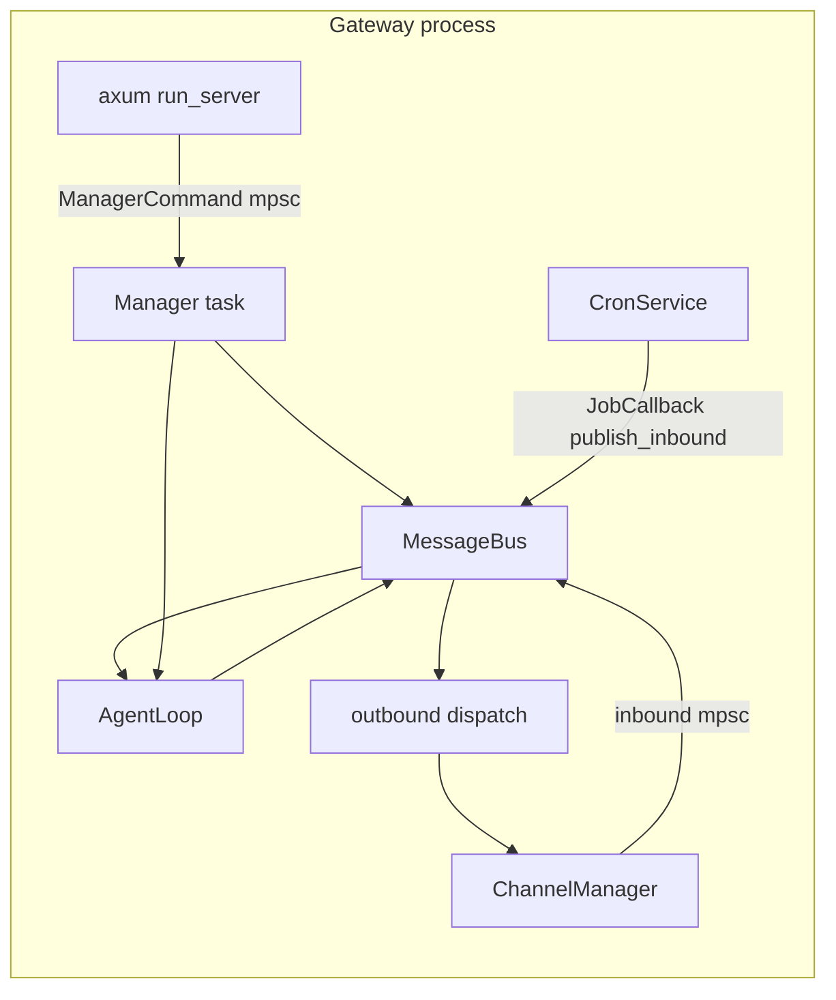
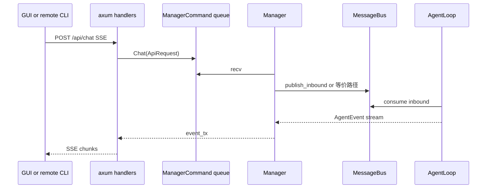

# agent-diva-nano：网关与控制面架构（开发向）

> **主产品 CLI**（`agent-diva-cli`）本地网关 **仅** 使用 **`agent-diva-manager`**。**`agent-diva-nano`** 为 **独立嵌套 workspace**（[`external/agent-diva-nano`](../../../../external/agent-diva-nano)），**不**参与根 `cargo build`。状态见 [nano-externalization-status.md](./nano-externalization-status.md)。

本文说明 **网关进程** 的 **进程模型、并发任务、消息流、HTTP 与控制面职责**。**§4–§7** 以 **`agent-diva-manager` 源码** 为主索引（**正式线**）；**nano** 平行实现见 **`external/agent-diva-nano/src/`**，拓扑与对外 HTTP 契约应对齐。与 [agent-diva-nano-implementation-plan.md](./agent-diva-nano-implementation-plan.md) 互补。

---

## 1. 文档关系与读者

| 文档 | 作用 |
|------|------|
| [agent-diva-nano-implementation-plan.md](./agent-diva-nano-implementation-plan.md) | 职责范围、CLI/TUI、路由验收表、阶段与风险 |
| 本文 | **运行时拓扑**、模块依赖、迁移时的代码地图 |
| [minimal-gui-agent-diva-implementation-plan.md](./minimal-gui-agent-diva-implementation-plan.md) | minimal 总计划与方案比选（**无 GUI、有 TUI**） |
| [crates-io-publish-strategy.md](./crates-io-publish-strategy.md) | 发布闭包与 DAG |

---

## 2. 术语

| 术语 | 含义 |
|------|------|
| **网关进程** | 执行 `agent-diva gateway run` 的 OS 进程：内嵌 MessageBus、AgentLoop、ChannelManager、Cron、HTTP 服务等 |
| **GUI 进程** | Tauri 宿主进程：**仅全功能 SKU**；负责窗口、前端资源、**按需子进程启动网关**（见 §3.1） |
| **minimal SKU** | **不**包含 GUI 进程；终端交互以 **`agent-diva tui`** 等为主 |
| **控制面** | 对运行时的配置与操作：provider/model、channels、tools、skills、MCP、cron、会话等——当前主要经 **HTTP + `Manager`** |
| **数据面** | 用户消息进入 bus → AgentLoop → 出站回频道或 API 流 |

---

## 3. 进程模型（现状）

**与 minimal 的关系**：下文 **§3.1** 描述 **全功能桌面版**（Tauri + 子进程网关）。**minimal / nano** 发行线 **不包含 §3.1**；用户直接使用 **§3.2 纯 CLI**（含 **`tui`**，单进程终端 UI）与可选的 **`gateway run`**。

### 3.1 桌面 GUI 路径（全功能 SKU）

典型安装下，**GUI 与网关是父子进程**：

1. 用户启动 **Tauri 应用**（[`agent-diva-gui/src-tauri/src/lib.rs`](../../../../agent-diva-gui/src-tauri/src/lib.rs)）。
2. `setup` 中在短延迟后调用 **`start_gateway`**（[`commands.rs`](../../../../agent-diva-gui/src-tauri/src/commands.rs)）。
3. `start_gateway` 使用 **`TokioCommand`** 派生子进程：  
   `{agent-diva.exe} --config-dir <dir> gateway run`（stdin/stdout/stderr 常重定向为 null，后台运行）。
4. 子进程内执行 [`run_gateway`](../../../../agent-diva-cli/src/main.rs)：在 **127.0.0.1:3000** 起 HTTP（[`run_server`](../../../../agent-diva-manager/src/server.rs)）。
5. 前端通过 **HTTP**（默认 `http://localhost:3000/api/...`）与会话流（SSE）与网关交互；Tauri **invoke** 仍用于部分本地能力（配置路径、启停网关进程等）。

因此：**「单盘心智」**在用户体验上仍是「开一个应用」，但 **OS 层面默认是两进程**（GUI + CLI 网关）。迁往 nano 时，可保持该模型，也可评估 **单进程内嵌网关**（GUI 直接 `tokio::spawn` nano 运行时），属产品/工程权衡，会改动 `commands.rs` 的启动方式。

### 3.2 纯 CLI 路径（含 TUI；minimal 主场景）

用户在终端执行 `agent-diva tui`：**单进程**、**无 Tauri**；**本地模式**下 ratatui 走 CLI 内 agent 路径，**不依赖** 已启动的 `gateway run`。若使用 **`--remote`**，则 TUI 经 HTTP 连接已有网关（与 `ApiClient` 同类）。执行 `agent-diva gateway run`：**单进程** 即完整网关（可含 axum）。**minimal** 可组合上述场景，**均不带桌面 GUI**。

### 3.3 Windows 服务

[`agent-diva-service`](../../../../agent-diva-service/src/main.rs) 通过兄弟目录下的 `agent-diva.exe` 调用 **`gateway run`**，与 GUI 子进程模型一致，均依赖 **网关二进制行为稳定**。

### 3.4 CLI `gateway run`（主产品）

- **唯一路径**：[`agent-diva-cli/src/main.rs`](../../../../agent-diva-cli/src/main.rs) 中 `run_gateway` 使用 **`agent_diva_manager::run_local_gateway`**（见 [agent-diva-cli/Cargo.toml](../../../../agent-diva-cli/Cargo.toml)）。

### 3.5 独立 nano workspace（模板线）

- **位置**：[`external/agent-diva-nano`](../../../../external/agent-diva-nano)；构建：`cd external && cargo build -p agent-diva-nano`。
- **源码**：[`runtime.rs`](../../../../external/agent-diva-nano/src/runtime.rs)、[`server.rs`](../../../../external/agent-diva-nano/src/server.rs)、[`handlers.rs`](../../../../external/agent-diva-nano/src/handlers.rs)、[`manager.rs`](../../../../external/agent-diva-nano/src/manager.rs)、[`state.rs`](../../../../external/agent-diva-nano/src/state.rs)。**不**依赖 `agent-diva-manager` crate。

### 3.6 端口与冲突处理

GUI 侧在启动前检查 **3000 端口**（[`commands.rs`](../../../../agent-diva-gui/src-tauri/src/commands.rs) 与 [`process_utils`](../../../../agent-diva-gui/src-tauri/src/process_utils.rs)）：若被占用，尝试识别并结束本产品的 gateway 进程，否则向用户报错。**nano 迁移时若变更端口或改为仅 IPC，必须同步改 GUI 与文档**。

---

## 4. 网关进程内部：并发与职责（`run_gateway`）

以下对应 [`agent-diva-cli/src/main.rs`](../../../../agent-diva-cli/src/main.rs) 中 `run_gateway` 的 **逻辑顺序**（实施时以源码为准）。

### 4.1 初始化顺序（概念）

1. **加载配置**（`CliRuntime::load_config`），校验 provider。
2. **`MessageBus::new`**。
3. **`CronService::new`**，注册 **`JobCallback`**：到点时将任务封装为 **`InboundMessage`** 并 `publish_inbound`；对 `gui` 投递目标有 **桥接逻辑**（将会话路由到 `api` 通道与 `cron:` 前缀 chat_id，便于 GUI SSE 消费）。
4. **`DynamicProvider` + `AgentLoop::with_tools`**（含 soul、cron、mcp_servers、`runtime_control` 通道等）。
5. **`ChannelManager::new`**，`set_inbound_sender` + **tokio 任务** 将 channel 侧入站消息 **桥接** 到 `bus.publish_inbound`。
6. 为各启用频道 **`bus.subscribe_outbound`**，回调内 **`channel_manager.send`**。
7. **`Manager::new`**（持有 `api_rx`、`bus`、`dynamic_provider`、`ConfigLoader`、channel_manager、`runtime_control_tx`、`cron_service` 等）。
8. **并行任务**（均为 `tokio::spawn` 一类）：
   - **outbound** `dispatch_outbound_loop`
   - **channel_manager** `start_all`
   - **agent** `run`
   - **manager** `run`（轮询 `ManagerCommand`）
   - **HTTP** `run_server(AppState { api_tx, bus })`
9. 关机：`ctrl_c` 或 manager 异常路径 → **`bus.stop`** → 通知 HTTP shutdown → abort/等待各任务 → **`channel_manager.stop_all`** → **`cron_service.stop`**。

### 4.2 不变量（迁移 nano 时需保持或显式废弃）

- **AgentLoop 唯一消费 bus 入站**（与 channel/API 写入方式解耦）。
- **出站** 必须通过 bus 的订阅机制送达各 channel；API 侧响应走 **AgentEvent 流 + SSE**，与 outbound 队列不同路径。
- **Cron → gui** 的 metadata / channel 映射若有变更，需同步测 **CronTaskManagementView** 与后台 SSE。

---

## 5. `MessageBus`（agent-diva-core）

实现见 [`agent-diva-core/src/bus/queue.rs`](../../../../agent-diva-core/src/bus/queue.rs)。

- **入站**：`publish_inbound(InboundMessage)` → AgentLoop 消费。
- **出站**：`publish_outbound` + **`subscribe_outbound(channel, callback)`** → 各聊天频道发送回复。
- **广播事件**：`publish_event` / `subscribe_events`（`AgentBusEvent`），用于跨组件观测。

nano **不替换** MessageBus；替换的是 **谁** 在网关进程里创建 bus 以及 **谁** 处理 HTTP 发来的 Chat/Config 等命令。

---

## 6. 控制面分层：`agent-diva-manager`（主产品）与 `external/agent-diva-nano`（模板线）

**主产品**：下列路径指向 **`agent-diva-manager/src/...`**。  
**nano**：平行类型与路由在 **`external/agent-diva-nano/src/`**，须与对外 HTTP 契约及 `--remote` / GUI 行为 **对齐**（或显式文档化差异）。

### 6.1 `AppState` 与 HTTP（manager；nano 见 `external/agent-diva-nano/src/state.rs`）

[`AppState`](../../../../agent-diva-manager/src/state.rs) 仅含：

- **`api_tx: mpsc::Sender<ManagerCommand>`** —— 所有 handler 将请求转为命令送入队列；
- **`bus: MessageBus`** —— 供需要直接读事件流的 handler 使用（如 SSE `/api/events` 订阅 `bus.subscribe_events()`）。

### 6.2 `ManagerCommand`（控制面「内部 API」）

[`ManagerCommand`](../../../../agent-diva-manager/src/state.rs) 枚举覆盖：

- 对话：`Chat`、`StopChat`
- 会话：`GetSessions`、`GetSessionHistory`、`DeleteSession`、`ResetSession`
- 配置与频道/工具：`UpdateConfig`、`GetConfig`、`GetChannels`、`UpdateChannel`、`GetTools`、`UpdateTools`
- Provider 相关（由 handlers 组合调用 catalog/registry，与 `Manager` 内状态同步）
- Skills：`GetSkills`、`UploadSkill`、`DeleteSkill`
- MCP：`GetMcps`、`CreateMcp`、`UpdateMcp`、`DeleteMcp`、`SetMcpEnabled`、`RefreshMcpStatus`
- Cron：`ListCronJobs`、`GetCronJob`、`CreateCronJob`、`UpdateCronJob`、`DeleteCronJob`、`SetCronJobEnabled`、`RunCronJobNow`、`StopCronJobRun`

每条命令多与 **`oneshot::Sender`** 配对用于请求/响应。**nano 库若搬迁 `Manager`，该枚举及处理逻辑是核心迁移单元**；若拆分，需保持 **语义与顺序**（例如配置更新后热更新 provider、MCP、工具限制等）。

### 6.3 `Manager::run`

[`manager.rs`](../../../../agent-diva-manager/src/manager.rs) 中 **`Manager`** 持有运行时状态（当前 provider/model/api_key、loader 句柄、`DynamicProvider`、`ChannelManager` 可选、`runtime_control_tx`、`CronService` 等），循环 **`api_rx.recv()`**，对 **`ManagerCommand`** 做：

- 持久化配置（经 `ConfigLoader`）
- 更新 `DynamicProvider`、网络工具配置等
- 与 **`AgentLoop`** 协调（如通过 `runtime_control`）
- 调用 **`McpService` / `SkillService`** 等辅助模块

**要点**：Manager **不是**「纯 REST 适配层」，而是 **带状态的运行时协调器**；迁 nano 时不能只搬 `server.rs` 而不搬 **命令处理与状态机**。

### 6.4 HTTP handlers

[`handlers.rs`](../../../../agent-diva-manager/src/handlers.rs) 将 axum 请求解析为 **`ManagerCommand`** 或直读 `MessageBus`：

- **`/api/chat`**：`Chat` 命令 + `ApiRequest` 内带 **`mpsc::UnboundedSender<AgentEvent>`**，将 agent 事件映射为 **SSE `Event`**（`delta`、`final`、`tool_*`、`reasoning_delta` 等）。
- **`/api/events`**：常基于 **`BroadcastStream`** 过滤 `AgentBusEvent`，供 GUI 后台事件。
- 其余路由：JSON 与 multipart（如 skill 上传）↔ 各类 `ManagerCommand`。

**CLI `--remote`** 的 [`ApiClient`](../../../../agent-diva-cli/src/client.rs) 默认 **`base_url = http://localhost:3000/api`**，对 **`POST /chat`** 使用 **eventsource** 解析 SSE 事件名；**nano 须保持事件名与载荷形态或同时更新客户端**。

---

## 7. 数据流简图（API 聊天）

`Manager` 对 **`Chat`** 的实现为：`publish_inbound(req.msg)`，再 **`subscribe_events`** 并 **`tokio::spawn`** 循环：将匹配 `channel`/`chat_id` 的 **`AgentBusEvent`** 转发到 **`ApiRequest.event_tx`**，直到 `FinalResponse` 或 `Error`（见 [`manager.rs`](../../../../agent-diva-manager/src/manager.rs) 中 `ManagerCommand::Chat` 分支）。

---

## 8. 迁往 `agent-diva-nano` 的代码地图（设想；非当前任务）

下列为 **软边界**，**仅在未来获准实施时** 作拆分参考；**不得**据此在本仓库主干删除 manager 源码。

| 当前位置 | 迁 nano 后的归属（建议） |
|----------|---------------------------|
| [`agent-diva-manager/src/server.rs`](../../../../agent-diva-manager/src/server.rs) | `agent-diva-nano`：`run_server` 或重命名 |
| [`agent-diva-manager/src/handlers.rs`](../../../../agent-diva-manager/src/handlers.rs) | `agent-diva-nano`：HTTP 适配层 |
| [`agent-diva-manager/src/state.rs`](../../../../agent-diva-manager/src/state.rs) | `agent-diva-nano`：`AppState`、`ManagerCommand` 等 |
| [`agent-diva-manager/src/manager.rs`](../../../../agent-diva-manager/src/manager.rs) | `agent-diva-nano`：核心协调（可改名 `NanoRuntime` / `GatewayController`） |
| [`agent-diva-manager/src/mcp_service.rs`](../../../../agent-diva-manager/src/mcp_service.rs) 等 | 一并迁入 nano，或下沉到更底层 crate（若希望复用） |
| [`agent-diva-cli/src/main.rs`](../../../../agent-diva-cli/src/main.rs) `run_gateway` | **变薄**：组装 `CliRuntime`/配置后调用 **`agent_diva_nano::run_local_gateway(...)`** |
| [`agent-diva-gui/.../commands.rs`](../../../../agent-diva-gui/src-tauri/src/commands.rs) | 首期 **可不变**（仍子进程启动 `gateway run`）；长期可选 **内嵌运行时** 并删除子进程 |

**依赖**：nano 将直接依赖 `agent-diva-core`、`agent-diva-agent`、`agent-diva-channels`、`agent-diva-tools`、`agent-diva-providers`（与现 manager 相近），**不再**依赖 `agent-diva-manager` crate。

---

## 9. `agent-diva-nano` 对外 API 草图（实施前约定）

以下为 **文档层占位**，实际签名在编码时确定，但建议在 PR 中保持 **单一入口**，避免 CLI 再次膨胀。

| 能力 | 建议形态（示意） |
|------|------------------|
| 启动本地网关 | `pub async fn run_local_gateway(options: NanoGatewayOptions) -> anyhow::Result<()>` |
| 配置来源 | `NanoGatewayOptions` 内含 `ConfigLoader` 或 `Config` + `workspace` 路径，与 `CliRuntime` 对齐 |
| 端口 | `port: u16` 默认 `3000`，与 GUI / `ApiClient` 默认一致 |
| 关机 | 内部 `tokio::signal::ctrl_c` 或传入 `broadcast::Receiver<()>`，便于 GUI 内嵌时由外部触发 |

**错误语义**：端口占用、配置无效、provider 缺失等应在 **nano 内** 返回明确错误，便于 GUI 子进程或内嵌模式统一展示。

---

## 10. 与「nanobot 式极简」的架构张力

| 维度 | 现状 | nano 可选方向 |
|------|------|----------------|
| 进程数 | **full**：GUI + 网关子进程；**minimal**：0 个 GUI，仅 CLI/TUI ± 网关 | full 维持或内嵌；minimal 保持无 Tauri |
| HTTP | 本地 axum（`gateway run`） | **full** 下兼容桌面前端；**minimal** 仅当需要 `--remote`/脚本时保留；**TUI 不依赖** |
| 模块体积 | manager + handlers 体积大 | 逻辑迁入 nano，**可按 feature 裁剪** 未使用的 HTTP 路由（需谨慎契约测试） |

---

## 11. 测试与观测建议

- **契约**：以 [agent-diva-nano-implementation-plan.md 第 6 节](./agent-diva-nano-implementation-plan.md) 路由表 + 本文 **§13 附录** **`ManagerCommand` 与路由对照** 为 checklist。
- **集成（full）**：`gateway run` + GUI 一轮对话 + **设置页**（config/providers/skills/mcp/cron）各至少点验一条写路径。
- **集成（minimal）**：**`tui` 多轮对话**；`chat`/`agent` 本地路径；若 SKU 含 `gateway run`，再测 `--remote` 或 HTTP 写路径。
- **回归**：`agent-diva-cli --remote` 对 **本地 nano 网关** 的 `ApiClient` 流式事件解析（与 TUI 独立）。
- **并发**：关机顺序与 **port 3000 释放**（**full** GUI 重启网关）在 Windows 上重点测。

---

## 12. 参考源码索引

| 主题 | 路径 |
|------|------|
| 网关主流程 | [`agent-diva-cli/src/main.rs`](../../../../agent-diva-cli/src/main.rs) `run_gateway` |
| HTTP 路由表 | [`agent-diva-manager/src/server.rs`](../../../../agent-diva-manager/src/server.rs) |
| 控制命令与状态 | [`agent-diva-manager/src/state.rs`](../../../../agent-diva-manager/src/state.rs) |
| Manager 主循环 | [`agent-diva-manager/src/manager.rs`](../../../../agent-diva-manager/src/manager.rs) |
| SSE / JSON handlers | [`agent-diva-manager/src/handlers.rs`](../../../../agent-diva-manager/src/handlers.rs) |
| 远程 CLI HTTP 客户端 | [`agent-diva-cli/src/client.rs`](../../../../agent-diva-cli/src/client.rs) `ApiClient` |
| GUI 启停网关子进程 | [`agent-diva-gui/src-tauri/src/commands.rs`](../../../../agent-diva-gui/src-tauri/src/commands.rs) |
| 消息总线 | [`agent-diva-core/src/bus/`](../../../../agent-diva-core/src/bus/) |

---

## 13. 附录：`ManagerCommand`、handler 与 HTTP 路由对照

以下按 **当前** [`server.rs`](../../../../agent-diva-manager/src/server.rs) 与 [`handlers.rs`](../../../../agent-diva-manager/src/handlers.rs) 整理，供迁往 `agent-diva-nano` 时 **逐路由验收**。若实现变更，应同步改本文与 [agent-diva-nano-implementation-plan.md 第 6 节](./agent-diva-nano-implementation-plan.md)。

### 13.1 按路由（方法 + 路径 → handler → 命令或其它依赖）

| HTTP | Handler | `ManagerCommand` / 其它 |
|------|---------|-------------------------|
| `POST /api/chat` | `chat_handler` | 默认：`Chat`；若 body `message` 为 `"/stop"`（trim 后）则 `StopChat`（经 SSE 返回文案） |
| `POST /api/chat/stop` | `stop_chat_handler` | `StopChat` |
| `POST /api/sessions/reset` | `reset_session_handler` | `ResetSession` |
| `GET /api/sessions` | `get_sessions_handler` | `GetSessions` |
| `GET /api/sessions/:id` | `get_session_history_handler` | `GetSessionHistory`（path 无 `:` 时前缀 `gui:`） |
| `DELETE /api/sessions/:id` | `delete_session_handler` | `DeleteSession`（同上 session_key 规则） |
| `POST /api/sessions/:id` | `delete_session_handler` | 同上（与 DELETE 共用逻辑） |
| `GET /api/events` | `events_handler` | **无**：仅 `state.bus.subscribe_events()` + 查询参数过滤后 SSE |
| `GET /api/config` | `get_config_handler` | `GetConfig` |
| `POST /api/config` | `update_config_handler` | `UpdateConfig` |
| `GET /api/channels` | `get_channels_handler` | `GetChannels` |
| `POST /api/channels` | `update_channel_handler` | `UpdateChannel` |
| `GET /api/tools` | `get_tools_handler` | `GetTools` |
| `POST /api/tools` | `update_tools_handler` | `UpdateTools` |
| `GET /api/skills` | `get_skills_handler` | `GetSkills` |
| `POST /api/skills` | `upload_skill_handler` | `UploadSkill` |
| `DELETE /api/skills/:name` | `delete_skill_handler` | `DeleteSkill` |
| `GET /api/mcps` | `get_mcps_handler` | `GetMcps` |
| `POST /api/mcps` | `create_mcp_handler` | `CreateMcp` |
| `PUT /api/mcps/:name` | `update_mcp_handler` | `UpdateMcp` |
| `DELETE /api/mcps/:name` | `delete_mcp_handler` | `DeleteMcp` |
| `POST /api/mcps/:name/enable` | `set_mcp_enabled_handler` | `SetMcpEnabled` |
| `POST /api/mcps/:name/refresh` | `refresh_mcp_status_handler` | `RefreshMcpStatus` |
| `GET /api/cron/jobs` | `list_cron_jobs_handler` | `ListCronJobs` |
| `POST /api/cron/jobs` | `create_cron_job_handler` | `CreateCronJob` |
| `GET /api/cron/jobs/:id` | `get_cron_job_handler` | `GetCronJob` |
| `PUT /api/cron/jobs/:id` | `update_cron_job_handler` | `UpdateCronJob` |
| `DELETE /api/cron/jobs/:id` | `delete_cron_job_handler` | `DeleteCronJob` |
| `POST /api/cron/jobs/:id/enable` | `set_cron_job_enabled_handler` | `SetCronJobEnabled` |
| `POST /api/cron/jobs/:id/run` | `run_cron_job_handler` | `RunCronJobNow` |
| `POST /api/cron/jobs/:id/stop` | `stop_cron_job_handler` | `StopCronJobRun` |
| `GET /api/providers` | `get_providers_handler` | **无**：`ConfigLoader` + `ProviderCatalogService::list_provider_views` |
| `POST /api/providers` | `create_provider_handler` | **无**：`save_custom_provider` → 磁盘配置 |
| `POST /api/providers/resolve` | `resolve_provider_handler` | **无**：`ProviderCatalogService::resolve_provider_id` |
| `GET /api/providers/:name` | `get_provider_handler` | **无**：`get_provider_view` |
| `PUT /api/providers/:name` | `update_provider_handler` | **无**：`save_custom_provider` |
| `DELETE /api/providers/:name` | `delete_provider_handler` | **无**：`delete_custom_provider` + `loader.save` |
| `GET /api/providers/:name/models` | `get_provider_models_handler` | **无**：`list_provider_models`（异步） |
| `POST /api/providers/:name/models` | `add_provider_model_handler` | **无**：`add_provider_model` + `loader.save` |
| `DELETE /api/providers/:name/models/:model_id` | `delete_provider_model_handler` | **无**：`remove_provider_model` + `loader.save` |
| `GET /api/health` | `heartbeat_handler` | **无**：固定返回 `"ok"` |

**说明**：

- **Provider 族**不经 `ManagerCommand`，但 **`UpdateConfig`** 等仍可能间接影响运行时；`Manager` 内对配置热更新与 **`DynamicProvider`** 的同步需在 nano 中保持等价行为（见 [`manager.rs`](../../../../agent-diva-manager/src/manager.rs)）。
- **`/api/chat`** 的 SSE 事件名（`delta`、`final`、`tool_start`、`tool_finish`、`reasoning_delta`、`tool_delta`、`error` 等）与 [`ApiClient`](../../../../agent-diva-cli/src/client.rs) 解析逻辑耦合，迁移时勿静默改名。

### 13.2 按 `ManagerCommand` 变体（反向索引）

| `ManagerCommand` | HTTP 入口（handler） |
|------------------|----------------------|
| `Chat` | `POST /api/chat`（非 `/stop` 分支） |
| `StopChat` | `POST /api/chat`（`/stop` 分支）、`POST /api/chat/stop` |
| `ResetSession` | `POST /api/sessions/reset` |
| `GetSessions` | `GET /api/sessions` |
| `GetSessionHistory` | `GET /api/sessions/:id` |
| `DeleteSession` | `DELETE` 或 `POST /api/sessions/:id` |
| `UpdateConfig` | `POST /api/config` |
| `GetConfig` | `GET /api/config` |
| `UpdateChannel` | `POST /api/channels` |
| `GetChannels` | `GET /api/channels` |
| `UpdateTools` | `POST /api/tools` |
| `GetTools` | `GET /api/tools` |
| `GetMcps` | `GET /api/mcps` |
| `CreateMcp` | `POST /api/mcps` |
| `UpdateMcp` | `PUT /api/mcps/:name` |
| `DeleteMcp` | `DELETE /api/mcps/:name` |
| `SetMcpEnabled` | `POST /api/mcps/:name/enable` |
| `RefreshMcpStatus` | `POST /api/mcps/:name/refresh` |
| `GetSkills` | `GET /api/skills` |
| `UploadSkill` | `POST /api/skills` |
| `DeleteSkill` | `DELETE /api/skills/:name` |
| `ListCronJobs` | `GET /api/cron/jobs` |
| `GetCronJob` | `GET /api/cron/jobs/:id` |
| `CreateCronJob` | `POST /api/cron/jobs` |
| `UpdateCronJob` | `PUT /api/cron/jobs/:id` |
| `DeleteCronJob` | `DELETE /api/cron/jobs/:id` |
| `SetCronJobEnabled` | `POST /api/cron/jobs/:id/enable` |
| `RunCronJobNow` | `POST /api/cron/jobs/:id/run` |
| `StopCronJobRun` | `POST /api/cron/jobs/:id/stop` |

---

## 参考链接

- [agent-diva-nano-implementation-plan.md](./agent-diva-nano-implementation-plan.md)
- [minimal-gui-agent-diva-implementation-plan.md](./minimal-gui-agent-diva-implementation-plan.md)
- [docs/userguide.md](../../../userguide.md)
