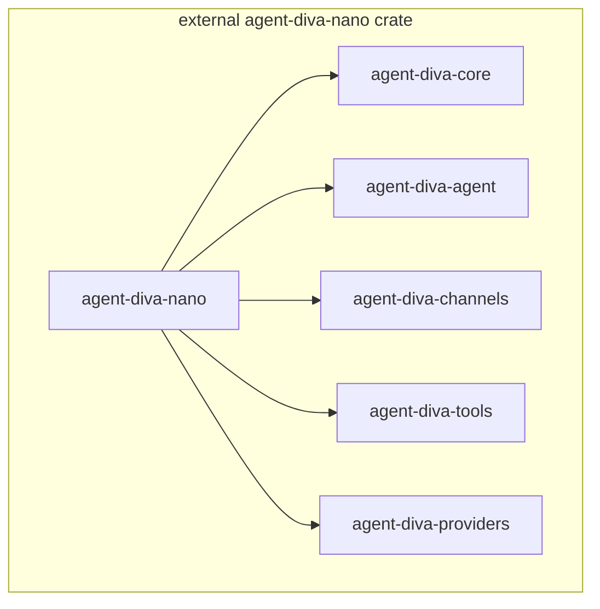

# agent-diva-nano：贴近 nanobot 的简化版 Agent Diva

> **产品语义与阶段边界**以 [nano-decoupling-preparation-plan.md](./nano-decoupling-preparation-plan.md) 为准：`agent-diva-cli` 为正式产品；`agent-diva-manager` 为 CLI 默认依赖；**`agent-diva-nano` 当前为官方最简实现**，中长期演化为**工作区外官方 starter/template**，**不作为正式产品 SKU**。硬性约束与历史规划见 [agent-diva-nano-master-spec.md](./agent-diva-nano-master-spec.md)。

**`agent-diva-nano`** 位于 **`external/agent-diva-nano/`**，由 [`external/Cargo.toml`](../../../../external/Cargo.toml) 单独 workspace 构建，**不是**根 workspace 成员。**本文只整理解耦讨论中的职责边界与阶段计划**，并引用 [minimal-gui-agent-diva-implementation-plan.md](./minimal-gui-agent-diva-implementation-plan.md)、[crates-io-publish-strategy.md](./crates-io-publish-strategy.md) 等上下文；主产品 **`agent-diva-cli`** **仅** 链接 **manager**。迁出独立 git 见 [agent-diva-nano-extracted.md](./agent-diva-nano-extracted.md)。

**能力边界（最简 / 模板向路径）**：该路径**不包含**需独立下载的 **Desktop companion**（`agent-diva-gui` 的 Tauri 应用形态；GUI **不属于 crates.io 发布闭包**），**保留 TUI**（`agent-diva tui`）及 CLI 其它子命令；本地网关若仍暴露 HTTP，主要服务于 **`--remote`、脚本、自动化或与 Desktop companion 共用契约**，而非要求用户必须安装桌面应用。

---

## 1. 文档关系

| 文档 | 作用 |
|------|------|
| [minimal-gui-agent-diva-implementation-plan.md](./minimal-gui-agent-diva-implementation-plan.md) | minimal 分阶段计划与方案 A/B/C 比选（**无 GUI、有 TUI**） |
| [agent-diva-nano-architecture.md](./agent-diva-nano-architecture.md) | **网关与控制面架构**（进程模型、并发任务、`Manager`/HTTP/bus、代码地图） |
| [crates-io-publish-strategy.md](./crates-io-publish-strategy.md) | crates.io 闭包、发布顺序、与 nanobot 对照维度 |
| [nano-decoupling-preparation-plan.md](./nano-decoupling-preparation-plan.md) | **解耦准备**：正式线 / 模板线 / 发布语义、阶段边界与迁移顺序 |
| 本文 | **官方最简实现（模板线前身）**：`agent-diva-nano` crate 职责、迁移面、验收与技术对照（与正式 **`cargo install agent-diva-cli`** 叙事分层） |

---

## 2. 定位与命名

### 2.1 crate 与二进制

- **`agent-diva-nano`**：**`external/agent-diva-nano/`** 内的 **库 crate**（嵌套 workspace），对外提供本地网关启动与生命周期等 API（具体类型名以代码为准）。**入口形态与并发拓扑**见 [agent-diva-nano-architecture.md](./agent-diva-nano-architecture.md) 第 9 节。
- **终端可执行文件**：面向用户的正式入口仍以 **`agent-diva`** 为主（[`agent-diva-cli`](../../../../agent-diva-cli/Cargo.toml) 的 `[[bin]]`），避免破坏 [agent-diva-service](../../../../agent-diva-service/src/main.rs)（通过兄弟目录调用 `agent-diva gateway run`）、既有脚本与 [docs/userguide.md](../../../userguide.md)。`agent-diva-nano` 是编排库，**不**作为与正式 CLI **并列的长期第二官方二进制 SKU**；若未来需要额外二进制名，属独立产品决策，与「模板线 / starter」定位分开讨论。

### 2.2 产品心智（与 nanobot 对齐）

与 [README.zh-CN.md](../../../../README.zh-CN.md) 中 nanobot 对照一致：

- **单进程、本地优先、安装即跑**；
- 技术栈仍为当前 Rust workspace 的 `agent-diva-core`、`agent-diva-agent`、`agent-diva-channels`、`agent-diva-tools`、`agent-diva-providers` 等；
- **远期讨论中**，最简/模板向构建闭包 **可能** 不链接 `agent-diva-manager`（见第 8 节策略）；**当前正式路径**下 **`agent-diva-cli` 默认依赖 `agent-diva-manager`**。解耦时**允许**调整边界，但**不以继续增加 crate 数量为架构目标**，优先在**更少 crate 边界**内收敛（见 [nano-decoupling-preparation-plan.md](./nano-decoupling-preparation-plan.md) §4.2）。

### 2.3 与历史 runtime 讨论的关系

[minimal-gui-agent-diva-implementation-plan.md](./minimal-gui-agent-diva-implementation-plan.md) 等文档中曾出现 **`agent-diva-runtime` 等占位名称**，将「独立 runtime 库」与编排落点绑在一起。按当前主文档 [nano-decoupling-preparation-plan.md](./nano-decoupling-preparation-plan.md) 的结论，这属于**历史占位说法**，**只保留为背景**，**不默认导向新增独立运行时 crate**，也**不把 `agent-diva-nano` 定义为长期正式运行时宿主**；编排与 HTTP 控制面最终落在哪个既有 crate / 模块，以实施后的代码为准。

---

## 3. 现状耦合（事实基线）

- **依赖链**：`agent-diva-gui` → `agent-diva-cli`（[agent-diva-gui/src-tauri/Cargo.toml](../../../../agent-diva-gui/src-tauri/Cargo.toml)）；`agent-diva-cli` → `agent-diva-manager`（硬依赖）。
- **网关路径**：[`run_gateway`](../../../../agent-diva-cli/src/main.rs) 在完成 MessageBus、CronService、AgentLoop、ChannelManager 等编排后，创建 `Manager` 并调用 `run_server`，默认在 **`http://127.0.0.1:3000`** 暴露 HTTP；**独立下载的 Desktop companion**（当前常见为子进程拉起网关）与 CLI 的 **`--remote`** 依赖该契约；**最简路径**用户可仅用 **TUI/本地 chat**，不强制开 HTTP。
- **结论（与当前代码一致）**：**主 CLI** **仅** **`agent-diva-manager`**。**`agent-diva-nano`** 在 **`external/`** 单独构建（`cd external && cargo build -p agent-diva-nano`），见 [`external/agent-diva-nano/Cargo.toml`](../../../../external/agent-diva-nano/Cargo.toml)。**迁出独立 git** 见 [agent-diva-nano-extracted.md](./agent-diva-nano-extracted.md)；收敛重复实现仍以 **更少 crate 边界** 为优先（见第 8 节与 [nano-decoupling-preparation-plan.md](./nano-decoupling-preparation-plan.md)）。

---

## 4. 目标依赖 DAG（最简 / 模板向讨论示意）

**模板线 / 独立 nano 包（非主 CLI 依赖图）**：下图表示 **`external/agent-diva-nano`** 作为 **独立 crate** 时的依赖示意；**主 `agent-diva-cli` 不** 出现在此闭包内。**与** [nano-decoupling-preparation-plan.md](./nano-decoupling-preparation-plan.md) **迁出后的形态对齐讨论用**。

**正式线 + Desktop companion**：桌面应用为 **独立下载渠道**，不在 crates.io CLI 闭包内；依赖上在以上之外常见为 `agent-diva-gui` →（当前）`agent-diva-cli` + `agent-diva-neuron` 等。companion 仍通过子进程或未来内嵌方式依赖 **同一套网关行为**。

**演进说明（非首期强制、非增 crate 目标）**：companion 可改为 **直接依赖 `agent-diva-nano`**；也允许 **仍通过 `agent-diva-cli` 库** 共享 `cli_runtime`、`client` 等模块，以降低与 [minimal-gui-agent-diva-implementation-plan.md 方案 C](./minimal-gui-agent-diva-implementation-plan.md) 类似的 **逻辑漂移** 风险。优先在**既有 crate 边界内**收敛，而非默认再拆 crate。**最简路径不包含 `agent-diva-gui` 构建，故不参与 companion 依赖演进。**

---

## 5. CLI 子命令与 TUI（最简 / 模板向路径下保留范围）

[`agent-diva-cli` 的 `Commands`](../../../../agent-diva-cli/src/main.rs)：**当前**本地网关 **始终** 经 **manager**。**若未来** 存在 **独立 nano 二进制/模板** 与 CLI 能力对齐时的 **讨论向** 预期如下：

| 子命令 | 最简 / 模板向说明 |
|--------|----------------|
| `onboard` | 保留；主要依赖 core/config，与 manager 无关 |
| `gateway run` | **当前**：经 **manager** 起本地网关。**若未来** 独立 nano 二进制或 CLI 再引入替代路径：可能改为调用 `agent-diva-nano`；若保留 axum，则满足 **`--remote`/脚本** 及 **Desktop companion 子进程** 的 HTTP 契约；**TUI 不依赖该 HTTP** |
| `agent` / `chat` | 保留；本地模式走消息总线与 agent；`--remote` 走现有 HTTP 客户端，指向 **仍提供 manager 兼容 API 的网关**（可为旧版全功能安装或独立服务） |
| `tui` | **明确保留**；ratatui 路径留在 CLI 内，不依赖 `agent-diva-manager` crate |
| `status` | 保留 |
| `channels` | 保留；若存在 remote 分支，契约与 `ApiClient` 一致 |
| `provider` | 保留 |
| `config` | 保留 |
| `service`（Windows） | 保留；若实施 nano，可能派生 `gateway run` 且网关实现换为 nano |
| `cron` | 保留 |

---

## 6. HTTP / API 兼容（迁移验收清单）

**契约表面**：**主产品**由 [`agent-diva-manager/src/server.rs`](../../../../agent-diva-manager/src/server.rs) 注册路由。**`external/agent-diva-nano`** 内 [`server.rs`](../../../../external/agent-diva-nano/src/server.rs)（及 `handlers`）应对齐 **同一 `/api/*` 行为**，供 **Desktop companion、`--remote` 与自动化客户端** 在对照/模板场景使用。**最简路径可不安装 companion**；下列路径为 **验收对照清单**（随代码变更同步更新本文）。**路由与 `ManagerCommand`、MessageBus 的关系**见 [agent-diva-nano-architecture.md](./agent-diva-nano-architecture.md) 第 6 节。

**CLI `--remote`** 的 HTTP 客户端见 [`agent-diva-cli/src/client.rs`](../../../../agent-diva-cli/src/client.rs)（默认 `http://localhost:3000/api`）；迁移时应与此处使用的路径与 SSE 事件名互相对照。

| 方法 | 路径 |
|------|------|
| POST | `/api/chat` |
| POST | `/api/chat/stop` |
| GET | `/api/sessions` |
| GET / POST / DELETE | `/api/sessions/:id` |
| POST | `/api/sessions/reset` |
| GET | `/api/events` |
| GET / POST | `/api/config` |
| GET / POST | `/api/providers` |
| POST | `/api/providers/resolve` |
| GET / PUT / DELETE | `/api/providers/:name` |
| GET / POST | `/api/providers/:name/models` |
| DELETE | `/api/providers/:name/models/:model_id` |
| GET / POST | `/api/channels` |
| GET / POST | `/api/tools` |
| GET / POST | `/api/skills` |
| DELETE | `/api/skills/:name` |
| GET / POST | `/api/mcps` |
| PUT / DELETE | `/api/mcps/:name` |
| POST | `/api/mcps/:name/enable` |
| POST | `/api/mcps/:name/refresh` |
| GET / POST | `/api/cron/jobs` |
| GET / PUT / DELETE | `/api/cron/jobs/:id` |
| POST | `/api/cron/jobs/:id/enable` |
| POST | `/api/cron/jobs/:id/run` |
| POST | `/api/cron/jobs/:id/stop` |
| GET | `/api/health` |

**ADR 建议**：最简/模板向路径下若需 HTTP，可选择 **内嵌 axum**（与现状一致），以满足 SSE（如 `/api/events`）与 **Desktop companion** 及 `--remote` 流式需求；若某构建变体完全去掉 `gateway run` HTTP，须同步界定 **TUI-only** 能力边界（与 Phase 0 一致）。「完全无 HTTP」与 **companion 子进程模型** 不兼容，除非 companion 改为纯 Tauri IPC 等替代集成。

**逐条路由与 `ManagerCommand` 的精确对照**（含不经命令队列的 Provider 路由）见 [agent-diva-nano-architecture.md](./agent-diva-nano-architecture.md) **§13 附录**。

---

## 7. `agent-diva-nano` 库职责边界（ADR 提纲）

1. **生命周期**：与当前 `run_gateway` 对齐——MessageBus、CronService（含 cron 将 `gui` 目标桥接到 `api` 通道的逻辑）、AgentLoop、ChannelManager、出站订阅与分发、优雅停机顺序。
2. **控制面**：承接原 `Manager::run` 所负责的 **运行时控制**（如 provider 热切换、与 `runtime_control` 通道协作）。细节以 [`agent-diva-manager/src/manager.rs`](../../../../agent-diva-manager/src/manager.rs) 为准；本文仅列职责，不锁实现。
3. **HTTP 面**：承接 `run_server` 与 handlers，默认监听地址/端口行为与现网一致（便于 **Desktop companion**、`--remote` 与文档），或与 [docs/userguide.md](../../../userguide.md) 中 `--remote` / `api_url` 说明一并修订并显式记录。**TUI 不经过该 HTTP。**
4. **默认暴露面（可选产品策略）**：若强调 nanobot 式「更少默认打开的能力」，优先通过 **配置默认值**（例如默认关闭各 channel）约束，而非从仓库移除 `agent-diva-channels`；与「保留 CLI 全部子命令」并存。

---

## 8. `agent-diva-manager` crate 的处理策略

与 [nano-decoupling-preparation-plan.md](./nano-decoupling-preparation-plan.md) 一致：**正式产品**默认仍为 **`agent-diva-cli` + `agent-diva-manager`**；下列策略仅描述**模板/最简路径或主线收口后**的讨论空间，**不以「为拆而拆、为增 crate 而增 crate」为目标**。

| 策略 | 说明 |
|------|------|
| **软删除（文档/迁移期约定）** | 工作区 **保留** `agent-diva-manager` 目录；某 feature 或路径 **不依赖** 该 crate。便于正式线对照、迁移期双轨 CI。 |
| **硬删除 / 目录收敛** | 将 server、handlers、state、manager 等 **迁入更少边界**（例如 `agent-diva-nano` 或保留在 manager 内但合并职责）后，再评估是否从 workspace 移除独立目录。破坏面大，需更新 CI、历史引用与发布顺序；**优先评估能否在更少 crate 内完成，而非默认新增多个宿主 crate**。 |

「删除 manager」在模板线语境下优先定义为：**某发行物或依赖闭包中不再链接**该 crate，与 [crates-io-publish-strategy.md 第 14 节](./crates-io-publish-strategy.md) 的讨论一致；是否物理删除目录为 **后续决策**。

---

## 9. `agent-diva-cli` 与 Cargo feature（与方案 A 结合）

- **`default` / `full`**：代表**正式产品**行为（**默认链接 `agent-diva-manager`**），与 crates.io 上 **`cargo install agent-diva-cli`** 的默认叙事一致。
- **`nano` / `minimal`（名称实施时选定）**：讨论中可表示关闭对 `agent-diva-manager` 的依赖、`gateway run` 走 `agent-diva-nano` 等；**是否保留多条 feature 路径以届时决策为准**，且**不以长期维护多条并列「正式 SKU」为默认方向**。
- 解耦目标为 **语义清晰 + 更少 crate 边界**，而非 feature 组合无限扩张；若收敛为单一依赖图，应在文档与发布说明中显式记录。

---

## 10. 分阶段里程碑（与 [minimal-gui-agent-diva-implementation-plan.md](./minimal-gui-agent-diva-implementation-plan.md) 对齐）

### 10.0 阶段边界与迁移顺序（与主文档一致）

- **当前阶段**（与 [nano-decoupling-preparation-plan.md](./nano-decoupling-preparation-plan.md) §2 一致）：以 **文档同步、边界确认、耦合盘点** 为主，**不**在本轮落地具体代码重构或迁仓。
- **推荐顺序**：**① 解耦准备（文档 + 清单 + 主产品闭包语义）→ ② 主线解耦 / 正式线收口 → ③ 将 `agent-diva-nano` 迁出 workspace 为独立 starter/template**（主文档 §8 补充说明）。下表 Phase 0–4 为**获准后的工程讨论**，易误读为立即排期；实施前须与主文档 Phase A–D 对齐。

**以下阶段仅在维护者批准的工程任务中考虑；默认排期以主仓库路线图为准。**

| 阶段 | 交付物（文档 / 工程） |
|------|------------------------|
| **Phase 0** | 签字：最简/模板向默认启用的频道/工具；是否保留 `--remote`；安装包命名与 **正式 CLI + 独立 companion** 区分（见 [minimal 第 5.0 节](./minimal-gui-agent-diva-implementation-plan.md)） |
| **Phase 1** | **若实施**：在**已有** `agent-diva-nano` 前提下梳理 **full / minimal** 两套 crate DAG（或收敛为更少边界）；**Desktop companion（Tauri）仅属独立下载轨**；minimal 验证 **无 `agent-diva-gui` 构建** |
| **Phase 2** | **若实施**：从 `run_gateway` 抽出入口至 nano 或收敛模块；ADR：内嵌 axum；正式路径与重构前行为可对比 |
| **Phase 3** | **若实施**：[docs/packaging.md](../../../packaging.md)、`just` 等增加 **minimal** 与 **正式线 + companion** 构建说明；companion 安装包脚本归属 **独立分发** |
| **Phase 4** | **若实施**：CI 矩阵；冒烟；crates.io 闭包更新见 [crates-io-publish-strategy.md](./crates-io-publish-strategy.md) |

**代码阶段完成后**：按 [AGENTS.md](../../../../AGENTS.md) 迭代协议在 `docs/logs/` 下建立版本目录，`verification.md` 记录 `just fmt-check`、`just check`、`just test`；**触及 `agent-diva-gui` 的变更** 仍遵守 **gui-changes-need-gui-smoke**；**仅最简 / CLI** 的迭代以 **TUI + gateway/chat** 冒烟为主。

---

## 11. 与 nanobot 的对照维度

可复用 [crates-io-publish-strategy.md 第 12 节](./crates-io-publish-strategy.md) 的对比表；**官方最简实现 / 模板线前身**在「进程模型」「管理/HTTP API」上向 nanobot 式 **单盘、轻量** 靠拢的方式是：**同一进程内嵌网关 + HTTP 控制面（可由 `agent-diva-nano` 承载讨论）**，而不是单独强调「独立 manager 服务」；**不与正式 `agent-diva-cli` 默认产品语义混写为并列长期 SKU**。

上游参考：<https://github.com/HKUDS/nanobot>

---

## 12. 风险与验收摘要

| 风险 | 应对 |
|------|------|
| 正式线 / 模板向双轨分叉，缺陷只出现在最简路径 | CI 矩阵覆盖相关路径；关键路径集中在稳定宿主（如 `agent-diva-nano`） |
| `Manager` 非纯 HTTP，迁移遗漏 provider/cron、Desktop companion 用 SSE | 以第 6 节路由清单 + 手工场景验收 |
| Desktop companion 与后端契约变更 | 契约版本化；必要时薄兼容层（**最简路径不受影响**） |

**建议冒烟清单**：**最简路径**：`tui` 会话；`gateway run`（若该构建包含）+ `chat`/`agent`；`--remote`（若保留）。**正式线 + companion**：另加 companion 启动与一轮对话；cron 指向 gui 的触发（若保留）。

---

## 13. 回滚

保留 **full / default**（正式产品）构建路径不变；模板向 feature 或渠道可通过 feature 关闭或暂停单独安装包，直至稳定。

---

## 参考链接

- [nano-decoupling-preparation-plan.md](./nano-decoupling-preparation-plan.md)
- [agent-diva-nano-architecture.md](./agent-diva-nano-architecture.md)
- [minimal-gui-agent-diva-implementation-plan.md](./minimal-gui-agent-diva-implementation-plan.md)
- [crates-io-publish-strategy.md](./crates-io-publish-strategy.md)
- [docs/packaging.md](../../../packaging.md)
- [AGENTS.md](../../../../AGENTS.md)
