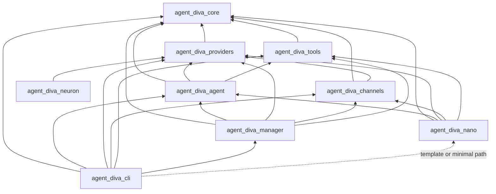

# Agent Diva：crates.io 发布与 GUI 分发方案

> **安全与变更分级**见 [agent-diva-nano-master-spec.md](./agent-diva-nano-master-spec.md)（**`agent-diva-nano` 在 `external/`**，主 CLI **无** `nano` feature）。**统一产品语义**见 [nano-decoupling-preparation-plan.md](./nano-decoupling-preparation-plan.md)：**`agent-diva-cli` 为正式产品**，依赖 **`agent-diva-manager`**；**`agent-diva-nano` 为当前官方最简实现**，中长期演化为 **starter/template**，**不作为正式产品 SKU**；**Desktop App 为独立下载的 GUI companion，不属于 crates.io 发布闭包**。**本仓库当前实现以现有 `Cargo.toml` 与源码为准**；下文含 **设想中的** 模板/最简拓扑时均已标注。

本文档说明如何将 Agent Diva **正式发布到 crates.io**，以及如何与 **独立下载的 Desktop companion（一键安装桌面体验）** 配合。与仓库根目录下的 [docs/packaging.md](../../../packaging.md) 互补：前者侧重 **预编译安装包与 CI**，本文侧重 **Rust 生态分发与产品路径选择**。

---

## 1. 背景与目标

- **crates.io**：Rust 官方包注册表，典型用法是 `cargo install <crate>`，在用户本机 **从源码编译** 安装二进制或依赖库。
- **「一键启动」**：终端用户通常期望 **下载安装包或从应用商店安装**，无需安装 Rust 工具链。
- **目标**：理清两条分发轨线的职责，避免把「上架 crates.io」误解为「普通用户双击即用 Desktop companion」的唯一方案；并明确 **crates.io 上默认安装的正式 `agent-diva` 即 `agent-diva-cli`（及其实际依赖闭包，含默认的 `agent-diva-manager`）**。

---

## 2. crates.io 能做什么 / 不能做什么

### 能做好的事情

- 为 **开发者、运维、CI 环境** 提供标准安装路径：`cargo install agent-diva-cli` → 得到命令行工具 `agent-diva`（crate 名与二进制名可以不同，以 [agent-diva-cli/Cargo.toml](../../../../agent-diva-cli/Cargo.toml) 为准）。这是 **正式的 headless 产品入口**，与 **独立下载的 Desktop companion** 渠道分离。
- 将内部库（`agent-diva-core` 等）作为 **可被其他 Rust 项目依赖** 的 crate（若团队希望开放二次开发）。

### 不适合单独承担的事情

- **替代桌面 GUI 安装体验**：`cargo install` 不产出 `.msi` / `.dmg` / 商店包；用户需本机 Rust、编译时间与平台原生依赖（如 Linux 上常见 OpenSSL、Windows 上 MSVC/WebView2 等与 GUI 相关的栈）。
- **Tauri 应用的完整发布**：GUI 依赖前端构建（如 pnpm + Vite）与 `tauri build` 的资源打包流程；与「只发布 Rust crate tarball」的流程不一致。详见第 4 节。

---

## 3. 推荐：双轨分发

| 轨线 | 受众 | 主要形态 | 典型命令/动作 |
|------|------|----------|----------------|
| **开发者/运维轨** | 已安装 Rust 的用户 | crates.io + `cargo install` | `cargo install agent-diva-cli` |
| **Desktop companion 轨** | 不需要 Rust 的用户 | **独立下载**：GitHub Release 安装包 + 可选包管理器（**不属于** `cargo install` 闭包） | 下载 NSIS/MSI/DMG/deb，或未来 winget/scoop/Homebrew Cask 等 |

两条轨线 **互补**：版本号与发版节奏可以 **对齐**（同一 git tag 触发 Release 与 crates publish），也可以 **companion 略晚于 CLI**（例如先验证 CLI crate 再推安装包），但应在用户文档中写清楚 **「要命令行（`cargo install agent-diva-cli`）」还是「要 Desktop companion」**。

详细打包步骤见 [docs/packaging.md](../../../packaging.md)（含 Windows GUI 脚本 `scripts/package-windows-gui.ps1`、`just package-windows-gui` 等）。

---

## 4. GUI 与 crates.io 的关系（为何不主推 `cargo install` GUI）

[agent-diva-gui/src-tauri/Cargo.toml](../../../../agent-diva-gui/src-tauri/Cargo.toml) 为 Tauri 应用，依赖路径形式的内部 crate 与前端工程。

| 维度 | `cargo install`（crates.io） | 安装包 / Release（packaging 路线） |
|------|------------------------------|-------------------------------------|
| 目标用户 | 有 Rust、能接受编译与排错 | 普通用户，安装即用 |
| 构建 | 难以等价覆盖 Tauri 完整产物链 | `tauri build` + CI 固定环境 |
| 平台差异 | 落在用户本机 | 由发布方在流水线中处理 |

**建议**：**默认不要将 `agent-diva-gui` 作为面向终端用户的主渠道上架 crates.io**；Desktop companion 的正式分发以 **Release 资产 + 安装器** 为主（与 [nano-decoupling-preparation-plan.md](./nano-decoupling-preparation-plan.md) §3.1 一致）。若维护者确有需求，可单独评估「仅作源码级安装」的文档说明与支撑成本，但不改变上述产品主路径。

---

## 5. 需发布到 crates.io 的 crate 与顺序

根 [Cargo.toml](../../../../Cargo.toml) 工作区包含多个成员。若仅让 **`cargo install agent-diva-cli`** 在 **仅依赖 crates.io** 的环境下可用，需要将 CLI 的 **所有内部 path 依赖** 一并发布，并在各 `Cargo.toml` 中为这些依赖写上 **与 `path` 并存的 `version`**（发布 tarball 时使用版本解析；本地开发仍可用 workspace path）。

**正式默认闭包**：面向大众的 **`cargo install`** 叙事以 **`agent-diva-cli` + 默认依赖（含 `agent-diva-manager`）** 为准，见 [nano-decoupling-preparation-plan.md](./nano-decoupling-preparation-plan.md) §3.1。**历史说明**：crates.io 上若曾出现偏 **nano / 最简** 路线的已发布产物，**不改变**「正式线以 CLI + manager 为默认」的演化目标；后续顺序仍为 **解耦准备 → 主线收口 → nano 迁出 workspace**（主文档 §8）。

### 5.1 依赖关系（发布顺序参考）

下列有向边表示「依赖」关系（被依赖者应先发布或同批次按拓扑顺序发布）。**图中 `agent-diva-nano` 与虚线 `cli → nano` 为讨论中的模板/最简路径示意，不是「默认正式 `cargo install` 闭包」的唯一形态；当前默认 CLI 依赖 `agent-diva-manager`。**

**说明**：上图便于 **拓扑排序讨论**；其中 **nano 路径为模板/最简向远期讨论**。**当前仓库默认正式路径**为 `cli → mgr`。详见 [nano-decoupling-preparation-plan.md](./nano-decoupling-preparation-plan.md)、[agent-diva-nano-master-spec.md](./agent-diva-nano-master-spec.md) 与 [agent-diva-nano-implementation-plan.md](./agent-diva-nano-implementation-plan.md)。**解耦允许，但不以继续增加 crate 数量为目标**，优先在更少 crate 边界内收敛（主文档 §4.2）。

**建议发布集合（正式 CLI 闭环，与当前仓库默认一致）**：

1. `agent-diva-core`
2. `agent-diva-providers`、`agent-diva-tools`（仅依赖 core）
3. `agent-diva-channels`、`agent-diva-neuron`
4. `agent-diva-agent`
5. `agent-diva-manager`
6. `agent-diva-cli`（提供二进制 `agent-diva`；**crates.io 上默认安装的正式 `agent-diva`**）

**讨论中的发布集合（最简 / 模板向）**：仅当未来某构建变体中 `agent-diva-cli` 不依赖 manager 且由 `agent-diva-nano` 等承担网关编排时适用；精确形态以届时 `Cargo.toml` 为准，且不承诺为与正式线长期并立的第二套默认 `cargo install` 叙事。

1. `agent-diva-core`
2. `agent-diva-providers`、`agent-diva-tools`
3. `agent-diva-channels`、`agent-diva-neuron`（若 CLI / Desktop companion 仍需要；以实施后的 `Cargo.toml` 为准）
4. `agent-diva-agent`
5. **承接本地网关编排与 HTTP 控制面的既有 crate / 模块**（具体落点以实施后的 `Cargo.toml` 为准；不预设为新增 crate）
6. `agent-diva-cli`

### 5.2 可选 crate

- **`agent-diva-migration`**：仅依赖 core，可独立版本节奏；适合 `cargo install agent-diva-migration` 的迁移场景。
- **`agent-diva-service`**：当前无内部 path 依赖，发布成本低；面向 Windows 服务场景，是否上架由产品定位决定。

### 5.3 现状与改造要点（实施时）

- 当前各 crate 之间多为 **仅有 `path`、无 `version`**，**无法直接 `cargo publish`**；需改为 `path = "…", version = "…"` 等形式（具体以 Cargo 当前文档为准）。
- **版本号需统一策略**：例如历史上 `agent-diva-manager` 与 `agent-diva-core` / `agent-diva-cli` 版本不一致时，发布前应明确 **同步主版本** 或 **文档化兼容范围**，避免依赖解析混乱。

---

## 6. Manifest 与元数据建议

对每个将发布的 crate：

- **`license`**：与仓库根 `LICENSE` 一致（例如 MIT）。
- **`repository`**、**`description`**：与 [agent-diva-core/Cargo.toml](../../../../agent-diva-core/Cargo.toml)、[agent-diva-cli/Cargo.toml](../../../../agent-diva-cli/Cargo.toml) 等已有写法对齐；`agent-diva-manager` 等需补齐缺失项。
- **`readme`**（可选）：可指向或复用根 README 片段，改善 crates.io 展示。
- **`rust-version`**：与工作区 [Cargo.toml](../../../../Cargo.toml) 中 `workspace.package.rust-version`（如 `1.80.0`）保持一致，便于用户与 docs.rs 预期一致。

---

## 7. CI 与发版流程建议

- **发布顺序**：严格按内部依赖 DAG 执行 `cargo publish`（或借助工具一次编排），避免下游 crate 找不到上游版本。
- **工具**：评估 [cargo-release](https://github.com/crate-ci/cargo-release)、[cargo-publish-workspace](https://crates.io/crates/cargo-publish-workspace) 等，用于 **版本 bump、changelog、按序 publish**，降低人为遗漏。
- **自动化**：在 CI 中仅用 **只读/发布令牌** 触发 publish；crates.io 账户建议开启 **2FA**，API token 仅存密钥管理设施。
- **与 Release 对齐**：可选地在同一 tag 上同时：构建 [docs/packaging.md](../../../packaging.md) 中的产物并上传 GitHub Release，再执行 crates.io publish（顺序视团队验证习惯而定）。

---

## 8. docs.rs 与用户文档

- 发布的 **库 crate** 会在 docs.rs 上构建文档；若某 crate 默认 feature 过重导致构建超时，需通过 **拆分 feature 或默认关闭重依赖** 等方式优化（按届时实际情况处理）。
- **用户可见说明**：在 README 或安装文档中明确区分：
  - 「安装 CLI：`cargo install …`」
  - 「安装桌面版：见 Release / packaging 指南」

避免用户误以为 `cargo install` 即获得 GUI 安装包。

---

## 9. GUI 正式分发建议（衔接 packaging）

- **权威流程**：以 [docs/packaging.md](../../../packaging.md) 为准（GitHub Actions、deb、Windows NSIS/MSI、macOS DMG 等）。
- **后续可增强**：在文档或独立迭代中记录 **winget、Scoop、Chocolatey、Homebrew Cask、Flathub** 等分发渠道的可行性；这些 **不要求** 与 crates.io 同步发版，但建议 **版本号对外一致** 以减少支持成本。

---

## 10. 风险与回滚（yank）

- **多 crate 协调风险**：漏发、版本不匹配会导致 `cargo install agent-diva-cli` 失败；应用第 7 节工具与检查清单缓解。
- **yank**：crates.io 上可对 **有问题的版本** 执行 yank，阻止新依赖拉取该版本，但 **不删除** 已缓存 artifact；重大问题时需发布修复版本并文档说明。
- **命名占用**：正式发布前在 [crates.io](https://crates.io) 搜索目标 crate 名是否可用；本文撰写时的粗查不代表发布当日状态。

---

## 11. 极简（minimal）路径、`agent-diva-nano` 与双轨分发

**正式线**：**`agent-diva-cli`**（默认 **`agent-diva-manager`**）+ **独立下载的 Desktop companion**（可选）。**模板/最简向**：**`agent-diva-nano` 当前为官方最简实现**，后续迁出为 **starter/template**（[nano-decoupling-preparation-plan.md](./nano-decoupling-preparation-plan.md)），**不作为正式产品 SKU**，也**不与「默认 `cargo install`」竞争同一语义**。

除上述外，**模板线 `agent-diva-nano`** 在 **`external/agent-diva-nano/`** 单独 workspace 构建（`cd external && cargo build -p agent-diva-nano`），**不**随根 `cargo build --workspace` 编译；**主 CLI 无 `nano` feature**（见 [agent-diva-cli/Cargo.toml](../../../../agent-diva-cli/Cargo.toml)）。**不构建 `agent-diva-gui`** 时即 **无 Desktop companion 构建**；正式 CLI 仍含 **TUI**（`agent-diva tui`）等能力。进一步裁剪与发布闭包见 [minimal-gui-agent-diva-implementation-plan.md](./minimal-gui-agent-diva-implementation-plan.md)。

与本文第 3 节 **不矛盾**：

- **终端用户（最简路径）**：以 **`cargo install agent-diva-cli`（默认正式叙事）** / CLI 安装包或轻量 Release 为主（见 [docs/packaging.md](../../../packaging.md)）；**不是**「双击 Desktop companion」路径。
- **终端用户（companion）**：**Desktop companion 一键安装** 仍走 **Release + 安装包**（及 packaging 流水线），**不在 crates.io CLI 闭包内**。
- **开发者**：**不链 manager** 的网关编排可在 **`external/agent-diva-nano`** 内开发与验证；是否在 **crates.io** 上单独发布该 crate/闭包仍属 **发布策略** 讨论（见第 14 节）。**不以继续拆 crate 为架构目标**，见主文档 §4.2。

**构建事实摘要**：**`agent-diva-cli`** **始终** 链接 **`agent-diva-manager`**。**`agent-diva-nano`** 为 **独立嵌套 workspace**，与主 CLI **依赖图分离**。二者均 **不** 把 Desktop companion（`agent-diva-gui`）算进同一 `cargo build` 闭包，除非显式构建 GUI。**进一步裁剪工具/频道或 crates.io 单列闭包** 见 [minimal-gui-agent-diva-implementation-plan.md](./minimal-gui-agent-diva-implementation-plan.md) 与第 14 节。**运行时职责落点以 `Cargo.toml` 为准**；编排与契约见 [agent-diva-nano-implementation-plan.md](./agent-diva-nano-implementation-plan.md)。

---

## 12. 与 nanobot 的对照及参考资料说明

仓库 [AGENTS.md](../../../../AGENTS.md) 约定：涉及 openclaw、**nanobot**、shannon 等姊妹项目时，优先查看 **`.workspace`** 目录。请注意：**当前克隆中 `.workspace` 可能为空或未跟踪**，因此下列对照 **不依赖** 本地目录树细节。

**建议资料来源**（任选其一，以可检出代码为准）：

- 本地：将 nanobot 置于 `.workspace` 后阅读其 **入口（CLI/gateway）**、**agent 主循环与配置加载**、是否存在 **独立 HTTP 管理进程**。
- 上游：<https://github.com/HKUDS/nanobot> 的 README 与「Architecture / Project Structure」等章节；其公开描述强调 **ultra-lightweight**、**minimal footprint**、**one-click deploy** 等与 OpenClaw 对比的产品取向。

**建议对比维度**（用于界定「极简 Diva」要做到哪一步，而非逐文件抄结构）：

| 维度 | nanobot 式极简倾向（概念层） | 当前正式线 Agent Diva（概念层；CLI + manager，companion 独立分发） |
|------|------------------------------|----------------------------------|
| 代码与依赖体量 | 强调极小核心与可读性 | 多 crate、channels/tools/manager 等生产化模块 |
| 进程模型 | 通常偏 **单进程/单服务** 心智 | Gateway 路径与 **manager 控制面** 紧耦合（见第 13 节） |
| 管理 / HTTP API | 需对照 nanobot 实际实现 | 当前网关路径使用 `agent-diva-manager` 的 `Manager` 与 `run_server` |
| 分发 | 一键部署叙事 | Desktop companion 走 Tauri 打包 + 文档中的 Release 流水线（**非** crates.io CLI 闭包） |

以上仅列 **调研维度**；具体目录与模块名以你检出的 nanobot 版本为准，避免在本文中虚构其仓库结构。

---

## 13. 调研结论：是否需要深度改造或架构优化

### 13.1 仓库内与「去掉 manager」相关的硬事实

- [agent-diva-gui/src-tauri/Cargo.toml](../../../../agent-diva-gui/src-tauri/Cargo.toml) 依赖 **`agent-diva-cli`**。
- [agent-diva-cli/Cargo.toml](../../../../agent-diva-cli/Cargo.toml) 将 **`agent-diva-manager` 列为硬依赖**。
- `agent-diva-cli` 中 **网关（gateway）** 路径（如 `run_gateway`）使用 `agent_diva_manager::Manager`、`AppState`、`run_server` 等，**在同一流程中内嵌 HTTP 管理/控制面**，而不是「可选远程附件」。

因此：若 **最简 / 模板向** 构建变体要求 **产物中不包含 `agent-diva-manager` crate**，则 **无法** 仅靠删除未使用代码完成，必须 **调整依赖边界与启动编排**。

### 13.2 是否算「深度改造」？

| 判断 | 说明 |
|------|------|
| **需要结构性工作** | 是。必须明确：**谁** 创建消息总线、启动 agent loop、cron，以及 **Desktop companion 所需的** API/SSE（最简路径无 companion 构建，但仍可能要 `gateway run`+HTTP 供 `--remote`）；若不再使用 manager，需迁移或重写与上述职责等价的逻辑落点。工作量一般为 **中–大**，随是否保留全频道、全工具、cron、远程模式而上升。 |
| **不必等于「推翻架构」** | 更可行的路径通常是：**Cargo feature 切分**（默认正式线 / 最简路径关闭 manager）、或在 **较少 crate 边界内** 收敛编排（由**更少 crate 收敛后的宿主/模块或既有 crate** 承担，**不预设 `agent-diva-nano` 为默认长期宿主**），manager 仅在正式 feature 下链接。**允许解耦，但不以继续增加 crate 数量为目标**（主文档 §4.2）。 |
| **与「架构优化」的关系** | 若仅做 feature 裁剪，可能 **不动** 深层抽象；若在既有 crate 内稳定 API，则属于 **明确的架构整理**。**`agent-diva-nano`** 在 **`external/agent-diva-nano/`**（**非**根 workspace 成员）；细节见 [agent-diva-nano-implementation-plan.md](./agent-diva-nano-implementation-plan.md) 与 [agent-diva-nano-master-spec.md](./agent-diva-nano-master-spec.md)。 |

### 13.3 风险与与正式线的兼容

| 项目 | 风险或成本 | 缓解思路 |
|------|------------|----------|
| 双轨维护 | 两套 feature/二进制路径，易出现「只测了正式路径」 | CI 矩阵中对 **minimal** 至少做 `cargo build`/冒烟测试 |
| companion 与后端契约 | 前端若假设 manager HTTP 始终存在 | 明确 API 表面：最简模式下 **进程内** 或 **简化 HTTP** 的契约文档 |
| crates.io / docs.rs | feature 组合爆炸 | 默认 feature 保持与现网一致；minimal 文档化 |

**分阶段实施清单与方案比选** 见：[minimal-gui-agent-diva-implementation-plan.md](./minimal-gui-agent-diva-implementation-plan.md)；**职责边界、HTTP 契约与阶段划分** 见：[agent-diva-nano-implementation-plan.md](./agent-diva-nano-implementation-plan.md)；**网关/控制面架构与迁移代码地图** 见：[agent-diva-nano-architecture.md](./agent-diva-nano-architecture.md)。

---

## 14. 对 crates.io 发布集合的影响（minimal / 模板向变体）

本文第 5.1 节给出的 DAG 以 **当前默认正式 `agent-diva-cli`** 为准，包含 **`agent-diva-manager`**。**本仓库当前即如此。**

**本地构建事实**：**不链 manager** 的编排由 **`external/agent-diva-nano`** 承担；**主 CLI 无** `--features nano` 路径。**以下为 crates.io 发布层面的补充讨论**：若未来将 **独立 nano 二进制或第二套 `cargo install` 变体** 作为可发布单元，则：

- **可能从该发布闭包中省略** `agent-diva-manager`（及仅被 manager 独占的依赖，若有）。
- **可能由已有 `agent-diva-nano` 作为当前最简实现参考，或由更少 crate 收敛后的宿主/模块承担** **`gateway run`（HTTP，可选）** 与 **Desktop companion 子进程** 所需的控制面（**不把 nano 写成默认长期承接宿主**）；**最简路径**仅需 CLI+TUI 时亦可对照该参考讨论无 manager 的网关路径，但与 **`agent-diva-manager` 在同一 `cargo install` 闭包中通常互斥**。**不将「必须再新增一个可发布 crate」作为默认结论**；优先在既有边界内收敛（主文档 §4.2）。
- **仍需发布** 的通常是：`agent-diva-core`、`agent-diva-providers`、`agent-diva-tools`、（视是否保留多平台消息而定）`agent-diva-channels`、`agent-diva-agent`，以及 **承接网关编排的 crate**——**精确列表以实施完成后的 `Cargo.toml` 为准**；计划在 [minimal-gui-agent-diva-implementation-plan.md](./minimal-gui-agent-diva-implementation-plan.md) 与 [agent-diva-nano-implementation-plan.md](./agent-diva-nano-implementation-plan.md) 中维护。

---

## 15. 小结

| 问题 | 建议答案 |
|------|----------|
| crates.io 上默认安装的正式 `agent-diva` 是什么？ | **`agent-diva-cli`**（二进制名多为 `agent-diva`），默认依赖闭包包含 **`agent-diva-manager`** 等内部库；`cargo install agent-diva-cli`。 |
| 如何让「会 Rust」的用户一键装 CLI？ | 发布相关内部库 + `agent-diva-cli` 至 crates.io，`cargo install agent-diva-cli`（同上）。 |
| 如何让普通用户一键用桌面界面？ | 以 **独立下载的 Desktop companion**（Release 安装包）为主，见 [docs/packaging.md](../../../packaging.md)；可选扩展包管理器。 |
| Desktop companion 是否应作为主路径上架 crates.io？ | **不建议**；与 Tauri 完整构建链及用户体验不匹配；**companion 不属于 crates.io CLI 发布闭包**。 |
| 最简路径（无 companion 构建、有 TUI；构建不链接 manager）是否还要动架构？ | **`external/agent-diva-nano`** 已承载 **不链 manager** 的网关参考实现；主 CLI 仍固定 manager。进一步裁剪工具/频道闭包或发布叙事仍可能需结构性工作，见第 13–14 节与 [minimal-gui-agent-diva-implementation-plan.md](./minimal-gui-agent-diva-implementation-plan.md)。**完全迁出独立 git、发布收口** 见 [nano-decoupling-preparation-plan.md](./nano-decoupling-preparation-plan.md)。 |

---

## 参考链接

- [nano-decoupling-preparation-plan.md](./nano-decoupling-preparation-plan.md)
- Cargo 发布说明：<https://doc.rust-lang.org/cargo/reference/publishing.html>
- 仓库打包指南：[docs/packaging.md](../../../packaging.md)
- nanobot（对照用）：<https://github.com/HKUDS/nanobot>
- minimal 实施计划（无 GUI、有 TUI；分阶段）：[minimal-gui-agent-diva-implementation-plan.md](./minimal-gui-agent-diva-implementation-plan.md)
- nano 运行时与契约：[agent-diva-nano-implementation-plan.md](./agent-diva-nano-implementation-plan.md)
- nano 架构详述：[agent-diva-nano-architecture.md](./agent-diva-nano-architecture.md)

