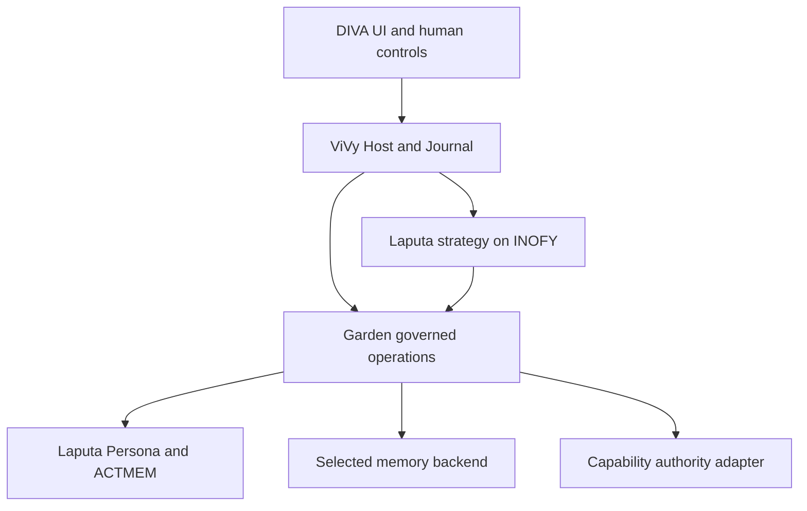

# Laputa / DIVA cognitive integration — detailed architecture

Date: 2026-10-02

Status: Written design for owner review. Product decisions listed as confirmed below are accepted in conversation; proposed defaults and interfaces are not shipped contracts. Story plans and readiness are maintained in [the plan index](../plans/2026-10-02-diva-cognitive/index.md); exact DTOs and serialization rules are maintained in [shared contracts](../plans/2026-10-02-diva-cognitive/contracts.md). It does not authorize product implementation. No runtime tests were executed for this document. No repository instructions, remote issues, branches or source files were changed.

Intended repository home after review: `docs/superpowers/specs/2026-10-02-diva-cognitive-integration-design.md` in ProjectViVy/laputa. Reconcile the existing modular-monolith index and relevant ADRs with this single design rather than maintaining a competing plan.

## 1. Outcome and confirmed decisions

Deliver one usable DIVA cognitive loop on the Go ViVy runtime: authorized experience reaches memory and activity state; a DIVA-inspired INOFY workflow reflects on it; typed outputs reach their domain authorities; authorized changes become visible in subsequent model requests and the product UI.

| ID | Confirmed requirement |
| --- | --- |
| R1 | One subject has one authoritative personality, independent of model, host UI and memory backend. Backend-generated profiles never override Laputa. Infrastructure has no independent collective mission or central will. |
| R2 | Same-subject personal long-term memory is shared across workspaces; project materials and their summaries are workspace-isolated by default. Cross-workspace reads require host authorization. |
| R3 | Ordinary memory consolidation is automatic under an enabled host policy. Do not require confirmation for every inferred memory. Preserve provenance, uncertainty and correction paths. |
| R4 | First delivery serves DIVA. Use the DIVA-inspired strategy; Hermes-style and other strategies remain later compositions. Reuse INOFY, not a second workflow engine. |
| R5 | Add `MISSION.MD`. Only an authenticated human can grant or modify it. Agent interpretations, goals and dreams cannot replace it or grant execution permissions. |
| R6 | `DREAM.MD` is an Agent's considered expression through an explicit tool invocation. AutoDream cannot directly patch it as a consolidation output. Do not require a new dream on each reflection. |
| R7 | Garden is the native governance pipeline for the integrated cognitive stack, whether embedded or served over a protocol. Laputa retains Persona authority; ordinary memory storage is replaceable. |
| R8 | Optional memory backends live in this repository. Mentle is the first production backend. Other vendor adapters are not first-delivery requirements. |
| R9 | Preserve separate memory, Persona, ACTMEM and capability-artifact authorities. No generic universal proposal inbox, duplicate memory authority or automatic default backend switch. |
| R11 | Evolution strategy semantics live entirely in a Laputa library package in this repository. ViVy calls the library and supplies governed runtime capabilities; no DIVA strategy rules or prompts are duplicated in ViVy. First strategy: DIVA. |
| R10 | ACTMEM uses one structured Markdown authority per subject, with Pulse / Recap / Work. Parse into typed in-memory values; JSON is transport only. No parallel ACTMEM database or JSON authority. Confirmed 2026-10-02. |

The user's statement that other directions were acceptable does not reverse R6. In particular, the earlier suggestion to let AutoDream automatically write DREAM is withdrawn. Existing distinctions for Persona requests and Agent tools remain unless explicitly changed here.

## 2. Source baseline and observed gaps

Inspected snapshots:

- Laputa: `384d54d3a5b98dc00e9c87bcd359c8d55c7ab5ad`.
- ViVy: `5347032d8f18a047b67e85761c0dcc48728bee7c`.
- INOFY: `71e2c9bbe47d5d095b27d756e38eaff565d93d36`.
- DIVA `dev`: `c565bb245cc920258d7f8c7fcd9544fbba545af7` (behavior reference, not the target Rust implementation).

| Existing surface | Observed fact | Design consequence |
| --- | --- | --- |
| `garden/agentapi/open.go`, `contract.go`, `policy.go`, `reads.go` | Host-bound profile/agent/session exists; there is no workspace binding. Search scope is caller input. Evidence expansion does not enforce per-record scope/status. | Add trusted workspace/access binding; enforce at discovery and expansion, including automatic recall. |
| `garden/internal/runtimecore/runtime.go` | Composition holds a concrete Mentle facade and local-model startup decisions. | Move backend-specific startup into a selected adapter; preserve the public Garden entrypoint. |
| `garden/internal/ingest/service.go`, `drain.go` | Capture and spool recovery create canonical memories without Scope. Workspace exists in an ingestion request but is not propagated into canonical writes. | Persist effective scope before acceptance and reuse it on every recovery path. |
| `laputa/persona/types.go` | Seven authority kinds and six Frozen Core slots; no Mission. | Make an explicit contract revision, including initialization, UI, snapshots and tests. |
| `laputa/persona/service.go` | Revision-aware direct Agent writes for DREAM/DARK/USER observations; separate Persona request and acceptance paths. | Reuse these semantics behind trusted Garden operations, adding durable operation identity where needed. |
| ViVy `internal/observerhost/host.go` | Journal replay, durable per-provider cursors, accepted/completed receipt handling and recovery run inventory exist. | Reuse delivery ownership; no new host outbox database. |
| DIVA `agent-diva-autodream/src/worker.rs` | Production path organizes ACTMEM Work and calls Skill reflection. | Persona reflection output is a missing product connection, not a demonstrated working loop. |
| DIVA `agent-diva-manager/tests/autodream_laputa_e2e.rs` | Tests primarily cover ACTMEM organization; the fixture disables the Skill reflection engine. | Test name or green historical result cannot certify Persona evolution. |
| ViVy issues #6 and #7 | AutoDream and typed composable evolution strategies are proposals. #7 distinguishes trigger, execution form and learning method. | Use their boundaries and update obsolete orchestration assumptions for INOFY. |

Historical tests recorded by the repositories are evidence of their respective snapshots, not fresh verification here. The local embedded smoke is not real ViVy adoption. Older REST-only SDK plans cannot serve unchanged as embedded implementation plans.

## 3. Architecture and alternatives

Choose one in-process Garden domain composition with a small backend contract and a Mentle adapter. ViVy owns runtime execution; INOFY supplies graph execution; Laputa owns evolution strategy definitions, node semantics and Persona/ACTMEM semantics; the selected backend owns ordinary canonical memory for its assigned scope. REST/MCP and DIVA UI are adapters over these boundaries. This reuses the shipped modular-monolith work while removing concrete backend coupling. Direct ViVy-to-Mentle integration would bypass governance and duplicate policies; an independent generic plugin marketplace or another cognitive service would add lifecycle and release costs without serving the first DIVA slice. Runtime-loadable provider code and a second scheduler are excluded.



There is one subject identity, not one identity per model, process or temporary child Agent. Bind existing ProfileID to that stable subject. AgentID remains actor/provenance. The first DIVA composition presents one companion; this design does not add a multi-companion product.

Garden owns the cognitive access pipeline, not the host's shell/network execution policy. INOFY executes a definition; it does not decide who may mutate a personality. Domain effect nodes invoke Host-authorized Garden operations and never receive file writers or database handles.

## 4. Persona, Mission and dream contracts

The authority roster becomes exactly eight uppercase Markdown files: `MISSION.MD`, `IDENTITY.MD`, `RELATIONSHIP.MD`, `REDLINE.MD`, `USER.MD`, `DREAM.MD`, `DARK.MD`, `WORLD.MD`. ACTMEM and MEMRULES remain separate. No ninth personality kind is implied by this design. Existing kind numeric identities remain stable when adding Mission.

| Target | Human | Conversational subject Agent | AutoDream/reflection workflow |
| --- | --- | --- | --- |
| MISSION | Create/edit/clear/restore through authenticated human operation | Read; no mutation or executable change request | Read as orientation; no mutation or executable change request |
| IDENTITY / RELATIONSHIP | Existing human edit and review | Persona request | Persona request |
| REDLINE / USER preferences | Existing human edit and review | Existing protected Persona request | No automatic mutation; retain existing restrictions |
| DREAM | Existing human editing surface | Explicit dedicated Agent tool, with reason and base revision | Reflection may inform the Agent; no dream-write effect or automatic tool dispatch |
| DARK / USER observations | Existing human edit/history | Existing bounded P16 tool path | Existing allowed Persona request; no new blanket auto-apply grant |
| WORLD | Existing protected claim rules | Existing governed tool/request behavior | Existing allowed claim request; preserve confirmed human content |
| ACTMEM | Governed maintenance | Scoped tool maintenance | Automatic scoped reconciliation |
| Ordinary memory | Governed CRUD | Governed tools | Automatic policy-authorized consolidation |
| Skill/SOP | Existing capability approval | Capability proposal | Capability proposal; no autonomous install |

A workflow-generated document or a forged actor field never counts as a human action. Mission mutations use a human-only control-plane capability absent from Agent tool catalogs, MCP Agent capabilities and evolution node catalogs. Apply authorization at the domain boundary, including initialization, repair, restore and generic full-document edits. Trusted-host bugs or unrestricted filesystem access can still bypass an in-process API: the authority directory must also be outside Agent-writable mounts, including shell paths, symlinks and generic file tools. This is an enforcement requirement, not a claim of protection against an administrator controlling the machine.

Mission text and Agent interpretation are distinct. Interpretations stay in ordinary derived reasoning or evidence-backed records, labelled as interpretation; no additional authoritative interpretation file or parallel mission database. Persona text is not a permission grant and cannot override tool policy or human redlines.

Proposed reviewable defaults: Mission has a 400-visible-grapheme maximum and is projected verbatim in full, with revision/hash. Do not summarize or truncate it with a model. Missing Mission is an explicit `unassigned` state, not a generated generic purpose; basic user-directed chat remains available. Mission-driven autonomous goals require an assigned Mission. These defaults avoid inventing a mission for an existing companion.

Frozen Core becomes a versioned seven-slot contract: Mission plus the existing six, excluding WORLD and ACTMEM. Use a versioned DTO with named kinds instead of silently changing the existing `[6]` wire shape. Preserve existing six projection limits; reserve the full Mission budget before optional memory candidates. Unsupported contract versions fail explicitly. A pre-Mission stored session is reported as requiring human-visible session renewal for the new contract; do not relabel an old snapshot as v2 or mutate an admitted resume snapshot.

Proposed Mission-change lifecycle: human writes a new revision; pending autonomous work pinned to the old Mission pauses at the next admission/effect boundary with `mission_revision_changed`. Do not claim to undo already executed actions. New runs capture the new Mission. Existing conversational sessions retain their immutable snapshot and offer an explicit new-session action; they may not silently continue autonomous old-Mission effects. Ordinary dream/personality revisions appear in the next session, with explicit tools available for current reads.

The dream tool describes a considered personal commitment, not routine summarization. Input includes exact proposed content, reason, base revision and authorized source references; output includes applied/no-change/conflict and revision. Content and existing dream projection limits remain intact. The model may choose no change. A workflow cannot evade its permissions by relabelling itself as the conversational Agent or automatically starting a child with P16 rights.

## 5. Scope and provenance

Use host-issued subject and stable workspace IDs, not model-supplied directory names. A session is bound to one subject and workspace; an explicit workspace change creates a new binding. Memory grants are immutable for an admitted operation and rechecked for revocation before disclosure or mutation.

Normal recall is the union of the subject's shared personal-memory scope and the current subject/workspace scope. An explicit read mount can add another scope without granting writes. Each scope has exactly one primary write destination. Backend selection is separate from embedded/remote transport selection.

Proposed typed internal values:

```go
// Proposed types; names are not existing SDK contracts.
type MemoryScope struct {
    SubjectID   string
    WorkspaceID string // empty only for explicitly admitted personal scope
}
type AccessBinding struct {
    SubjectID      string
    AgentID        string
    SessionID      string
    WorkspaceID    string
    PolicyRevision string
}
```

The public model request cannot supply an AccessBinding, allowed-scope list, principal or primary destination. Garden derives them from the Host session/authentication context. Backend scope serialization uses a versioned, unambiguous encoding and exact matching; no prefix-based authorization or wildcard meaning for an empty scope. Existing unscoped records are not silently made global: they remain stored and unavailable to scoped Agent recall until explicitly classified by the owner. No automatic destructive migration.

Project capture, imported material, recaps and ordinary summaries inherit project scope. Automatic personal-memory consolidation uses a distinct preauthorized operation and writes a new evidence-linked, bounded personal observation; it does not retag or move the project source. This operation is an explicit cross-scope disclosure policy: it permits a personal abstraction, not the underlying project contents. Record inference status and allow correction/tombstoning. Semantic classification is fallible; deterministic scope enforcement cannot prove that generated prose contains no project detail. Review tests must include negative examples and no-output outcomes, and status must not claim a formal semantic confidentiality guarantee.

Source references do not grant source access. Shared observations cannot auto-expand into private project content; even reference metadata must be filtered when it would reveal unauthorized information. Derived records preserve source lineage and do not count as independent corroboration.

The accepted DIVA D2 contract (2026-08-15) defines ACTMEM as a cross-session current activity working set with one independent Markdown authority, `ACTMEM.MD`. It is not a transcript summary or a second compact checkpoint. Preserve these distinct parts:

| Part | Meaning and lifecycle |
| --- | --- |
| Pulse | Recent short user utterances; system append on receipt; 280 characters per item, 1600 per section, oldest-first eviction. |
| Recap | One completion-state note immediately after each assistant final reply; at most 200 characters per item and 1600 per section. Reuse the existing conclusion or mechanically extract it; no additional model call. |
| Work | Current Goal / Open / Next / Constraints / Pointers; reconcile what remains actionable, remove completed or superseded work, retain only minimum evidence pointers. Limit 1600 characters; reject oversized writes rather than silently truncate. |
| Capsules | Session Pulse/Recap archive after 10 minutes of inactivity, at most 800 characters each; remove folded entries from the head. Not a second active head, not automatically restored or promoted to long-term memory. |

Work is more selective than Recap because it represents current state rather than retelling history; it is not merely a shorter recap. All sections remain tool-only, outside automatic prompt assembly and Frozen Core. SessionCheckpoint and canonical compaction remain separate. Preserve the existing shared revision-checked write kernel, including Work-conflict rejection and preservation of concurrent Pulse/Recap appends. Do not introduce a second activity-state store. The historical v1 has no ACTMEM revision-history/undo feature.

The old DIVA contract exposed one global head across projects/channels. The scoped projections below are a NEW adaptation to the user's project-isolation decision, not a claim about the old implementation. The old v1 also prohibited implicit STM-to-BML promotion. This design adds explicitly governed memory-consolidation effects in the evolution workflow; the Work organizer itself must not silently invoke long-term memory writes.

ACTMEM remains one subject-level activity authority, not a memory backend and not a personality file. Its structured source references/segments need workspace provenance in the existing activity-state machinery. An Agent/workflow receives only a projection authorized for its task; it never receives a concatenation of all project text merely because ACTMEM is subject-wide. Unknown-scope legacy ACTMEM segments are not admitted into cross-workspace model input. A whole-document reconciliation must possess explicit grants for every included segment; otherwise use revision-checked scoped updates preserving other segments. Human inspection remains distinct from Agent access. No per-project Persona copies are introduced.

### 5.1 ACTMEM storage and operation boundary

Confirmed storage choice: one subject-owned `actmem/ACTMEM.MD`, plus the existing capsule archive. Laputa owns parsing, validation and atomic writes; Garden supplies trusted access binding; ViVy supplies event identity and lifecycle triggers. The in-memory document and API JSON are projections of that Markdown, never independently persisted authorities. No ACTMEM records are inserted into the chosen ordinary-memory backend.

Use a versioned Markdown format with front matter for document revision/schema and scope metadata, and the three named body sections. Each managed entry has a stable ID and a metadata association in the same file: section, subject/workspace scope, originating session/event where applicable, and source references. Work entries additionally have a closed field kind: Goal, Open, Next, Constraints or Pointers. The serializer must round-trip human text and metadata together. Exact parser grammar and golden fixtures are a prerequisite of the ACTMEM contract Story, not an implementation agent's choice. Legacy unscoped content remains readable to the human owner but cannot enter Agent projections until classified. No sidecar database supplies missing scope authority.

The Host assigns scope at append time. Project Pulse and Recap inherit the session workspace. Work entries retain their source scope; Agent edits cannot relabel them as personal or another workspace. Personally shared Work is possible only through an explicitly admitted personal-scope operation, not an inference from an empty field. Restricted source pointers remain restricted even when another entry references them. Front matter is storage metadata, not model-editable authorization input.

| Operation family | Contract and failure behavior |
| --- | --- |
| Read activity | Garden binding determines visible scopes; select section/entries and apply the existing 1200-character tool response bound after filtering. Return document revision and visible entry IDs. Never return hidden text, hidden counts or hidden scope names. |
| System append | Host event identity plus trusted binding supplies a Pulse or Recap entry. Tools cannot impersonate this path. Duplicate retained event IDs are no-ops; the bounded rings are not advertised as a permanent delivery ledger. |
| Edit / complete / drop | Request names visible entry IDs or a new Work field, carries base revision, and changes only the admitted scope. The write kernel preserves all other entries. No Agent whole-document replacement API. |
| Reconcile Work | Workflow supplies only Work changes for its admitted scope. A stale write may retry once if only Pulse/Recap changed; any intervening Work change returns a conflict, with no model-derived overwrite. |
| Human save | Authenticated owner can edit the document through the product surface with base revision. Validate syntax, IDs, scope associations and caps; stale save returns conflict with no automatic retry. Invalid input leaves the previous valid file intact. |
| Fold capsule | Host folds only the eligible session's Pulse/Recap. Capsule entries retain scope metadata and use the same read filtering. Treat duplicate fold/restart using source entry IDs; do not describe multi-file rename as one atomic transaction. |

Capsule folding is archive-first: atomically write a capsule for a deterministic source-entry set, then revision-check removal of those same entries from the head. A crash between the two can leave the entries in both places temporarily; retry recognizes the existing matching capsule and finishes head removal. A mismatched existing capsule or intervening edits to source entries cause an explicit conflict, not deletion. Source changes and later appended entries are never consumed by a stale fold. Capsules are not automatically fed back into Work.

The first DIVA composition has one authoritative writer service per subject, owned by the ViVy Host. That service serializes read/validate/write inside the process; Garden embedded, REST and desktop operations share it. A second independent writer process is unsupported in this phase and must not open the same authority directory for mutation. Revision checks and atomic rename alone are not cross-process serialization. Direct external file editing requires stopping the writer; the normal human editing surface uses the same service.

Retain the existing global section budgets for this first slice; this is a bounded active head, not unlimited per-project history. Pulse/Recap oldest-first eviction is system maintenance. Work overflow rejects the attempted update without deleting other projects' entries; the caller receives a generic capacity error without hidden-content details. Human owner inspection can resolve capacity. No adaptive budget allocator, per-project replica or background database is introduced.

Storage or parse failure is visible and preserves the previous valid authority; it does not fall back to BML or silently reconstruct from capsules. A failed system append does not roll back an already visible chat reply. Human-visible health distinguishes stale activity from a successful update. Read-only activity access and ordinary-memory availability remain independent.

### 5.2 Scope enforcement beyond ACTMEM

Enforce policy across search cards, evidence expansion, collection counts, history/source pointers, KG/timeline queries, recall traces, errors and caches. A missing, forbidden or invalid record must not expose its content through an error. Expansion validates current scope, status, effective time and supersession from the same record revision used to render the excerpt; a check-then-refetch of mutable content is insufficient.

## 6. Optional memory backends in this repository

Keep `laputa/`, `garden/`, `mentle/`. Proposed public contract package: `garden/memory`; proposed first-party adapter package: `garden/backends/mentle`. Both are proposed paths. Keep future adapter code in this repository, introducing nested modules only when actual build/dependency separation requires it. No vendor-specific client types appear in Garden's public contract.

The executable/host composition imports the chosen adapter and injects its owned instance into Garden. Garden's domain/public contract packages import only `garden/memory`, never a backend implementation. The Mentle adapter imports that contract and Mentle, avoiding a dependency cycle. A host selecting no memory backend can still construct Persona services; ordinary recall/capture capabilities report unavailable as appropriate. The legacy convenience constructor can remain only if it does not force Mentle into the backend-neutral import closure; otherwise make selection explicit in the composition and document the API break. Dependency-closure verification must prove the selected build, not merely the existence of an interface.

Required DIVA backend semantics: bounded card search, authorized evidence expansion, revisioned read/create/update/tombstone, durable idempotent mutation results, scope preservation, stable source identity and truthful health. Optional capabilities: vector/hybrid search, KG/timeline and provider-native consolidation. A capability manifest advertises only tested behavior. Providers unable to meet the required mutation/scope contract cannot serve as this composition's primary writer; a supported narrower read-only mount is possible.

Proposed boundary shape:

```go
// Architecture-level signatures; concrete DTO definitions belong to the
// reviewed contract Story before implementation release.
type Backend interface {
    Capabilities() Capabilities
    Search(context.Context, AuthorizedSearch) (CardPage, error)
    Expand(context.Context, AuthorizedExpansion) (EvidencePage, error)
    Mutate(context.Context, AuthorizedMutation) (MutationReceipt, error)
    MutationStatus(context.Context, string) (MutationReceipt, error)
    Health(context.Context) (Health, error)
    Close() error
}
```

Authorized requests are generated by Garden, not deserialized directly from model JSON. Mutations are closed create/update/tombstone variants with target scope, stable operation ID, payload digest and expected revision. Create has an explicit absent-record condition. Reusing an operation ID with identical payload returns the original result; changed scope/content/target conflicts. Search and expansion receive effective grants. The adapter filters at the canonical record boundary before emitting content, and Garden validates returned scope/revision envelopes before exposing them to the caller.

Mentle canonical SQLite remains the authority for scopes assigned to Mentle; other providers retain their own canonical authority. Garden receipts, Journal events, vectors, BM25 and generated summaries are not extra canonical copies. Do not keep a parallel Mentle copy when another backend is selected.

Embedding modes belong inside the Mentle adapter: explicit local model, configured remote embedding, or the existing no-model lexical degradation. Reuse the current read-only lexical contract rather than silently introducing writable lexical storage. No model download or paid endpoint activation on implicit startup. Remote mode requires configured credentials and explicit endpoint policy, bounded timeouts, dimension/model identity checks and cancellation; exercise it with a local fake provider before any separately configured live-provider test. An injected logger must not record raw evidence or credentials by default.

Changing embedding identity does not reinterpret existing vectors. Expose derived-index rebuild/pending state and lexical availability where supported. Backend switching affects new work only; accepted captures and tasks retain their destination binding. A revoked destination blocks them explicitly. No fallback writes, automatic migration or default BML replacement.

Module identity recommendation for review: align publishable nested modules with this repository (`github.com/ProjectViVy/laputa/laputa`, `/mentle`, `/garden`), using directory-prefixed tags. Existing `github.com/dashimaki/*` imports require a deliberate source update. First verify a clean consumer against a local module proxy or packaged snapshot without sibling replacements; remote fetch/release evidence remains a distinct release gate. Do not publish tags as a side effect of this design.

## 7. Laputa-owned evolution library and DIVA strategy

One versioned DIVA strategy is selected for the initial product. Its source, prompts, eligibility rules, graph definition, node semantics and effect routing live in Laputa's evolution library. ViVy calls that library using its existing INOFY execution path; Garden's synchronous recall use of an ephemeral RunStore is not reused as proof of durable reflection recovery. The Host delivers timer/activity wakeups; Laputa evaluates the enabled evolution policy and decides whether a run is useful. Manual invocation uses the same execution path. Observers only record eligible activity and wake the dispatcher; they do not run model reflection inside delivery callbacks.

| Stage | Input and output | Allowed effects |
| --- | --- | --- |
| Admit | Host binding, workflow revision, Mission/persona revisions, source window, budgets, destinations | Existing runtime admission; reject unavailable required capabilities before model spending |
| Collect | Eligible committed activity and authorized source refs → bounded evidence batch | Reads only; exclude self-generated reflection/report activity as fresh evidence |
| Prepare evidence | Reuse authorized Pulse/Recap and source pointers; optionally summarize oversized evidence only when needed | Reads/inference only; this is not another ACTMEM Recap writer |
| Reconcile Work | Scoped ACTMEM snapshot + evidence → current Goal/Open/Next/Constraints/Pointers | Separate revision-checked Work effect; preserve system-owned Pulse/Recap |
| Reflect | Evidence, scoped ACTMEM and relevant Persona → typed outputs | Model inference only; no direct writes |
| Route effects | Validated outputs → domain operations | Automatic permitted memory updates; Persona requests; capability proposals |
| Finish | Per-operation outcomes + source watermark → completion/partial/no-change | Existing durable runtime evidence; no assertion that proposal submission equals application |

Reflection input can explicitly request ACTMEM/WORLD under its grants; this does not make them automatic foreground ContextView inputs. Original evidence may be retrieved when a recap is insufficient. The workflow may stop with no useful change. It does not automatically promote every request for improvement into a DREAM entry.

Typed output variants: `MemoryConsolidation`, `PersonaChangeRequest`, `CapabilityProposal`, `ReflectionNote`, `NoChange`. No `MissionWrite` or `DreamWrite` output. A dream-relevant note may later be explicitly read by the same subject Agent; that Agent decides independently whether to invoke its P16 dream tool. This preserves the user's distinction between background processing and a considered dream decision.

Automatic scheduling uses the existing host scheduler, an enabled elapsed-time/new-activity policy, foreground priority and one active task per subject/scope/destination. Numeric thresholds are configuration defaults to be calibrated, not imported as mandatory values from reference agents. Manual control and automatic execution ship in this DIVA phase. Reports remain report-only. Hermes strategy and comparative effectiveness experiments are later work.

Freeze topology, stage identities, configuration, input window and target bindings for each task. Stable operation IDs derive from task/node/logical effect identity; record payload hash and base revision. Advance the processed watermark only for completed or explicitly skipped inputs, independently of pending proposal review. Partial cancellation preserves already committed effects and unresolved operation state. Restart never substitutes a newer strategy definition.

### 7.1 Source ownership and dependency direction

Proposed packages in the existing repository/module layout:

| Package | Owned behavior | Forbidden dependency/responsibility |
| --- | --- | --- |
| `laputa/evolution` | Typed strategy input/output, DIVA eligibility, prompt content, effect validation and routing contract | No ViVy imports, host database, scheduler loop, direct Garden import, or raw authority file handles |
| `laputa/evolution/diva` | First concrete strategy, bounded Work reconciliation and reflection rules | No runtime plugin loader or alternate personality store |
| `laputa/evolution/inofy` | DIVA graph factory, descriptors, NodeExecutor adapter | No second RunStore or engine implementation; import INOFY public API only |
| `garden/agentapi` plus proposed `garden/evolution` | Bind authorized reads/effects to domain services and optional memory adapter | No competing DIVA prompts, strategy choice, or capability installation |
| ViVy `internal/runtime` | Trusted catalog composition, admission, model execution, durable Run/Journal, cancellation/recovery | No DIVA inference policy or direct Persona/ACTMEM writes |

Package paths are proposed; existing source paths in the Story plans are distinguished from additions. The core Persona/ACTMEM import closure need not import the evolution/INOFY packages. Use ordinary Go composition, not another dynamic extension protocol. Optionality is provided by which package the host imports.

Garden imports Laputa domain contracts. Laputa evolution depends on narrow consumer-defined ports; Garden supplies their implementations. This avoids a Laputa -> Garden -> Laputa import cycle. Capability proposals terminate at the existing EvoMap authority, and the strategy never owns its review/install state. Existing `garden/internal/evolution` is the EvoMap-facing service; it is not renamed into the new cognitive strategy engine.

### 7.2 Library contract proposed for implementation

The following is an architecture sketch. The exact signatures, fields, enums, format grammar and validation rules are frozen in the linked shared contracts; S01 implements those contracts before consumers start. Identity and effect authorization are bound by the host outside model JSON.

```go
// package evolution; all types here are proposed.
type StrategyID string
const DIVA StrategyID = "diva/v1"
type Wake struct { NowUnixMS int64; Manual bool; NewActivity bool; ForegroundBusy bool }
type TriggerPolicy struct { Enabled bool; MinIntervalMS int64 }
type TriggerState struct { LastCompletedUnixMS int64; ActiveRunID string }
type Eligibility struct { Run bool; Reason string }
func Evaluate(Wake, TriggerPolicy, TriggerState) Eligibility

type RunBinding struct {
    SubjectID string
    WorkspaceID string
    DestinationID string
    PolicyRevision string
    MissionRevision uint64
    StrategyDigest string
}
type Window struct { SourceID string; After uint64; Through uint64 }
type Input struct { Binding RunBinding; Window Window }
type ModelRequest struct { Stage string; Prompt string; InputJSON []byte; OutputSchema []byte }
type ModelReply struct { OutputJSON []byte }
type Model interface {
    Infer(context.Context, ModelRequest) (ModelReply, error)
}
// Bound on construction; methods do not accept model-provided principals.
type Domain interface {
    Collect(context.Context, Window) (EvidenceBatch, error)
    Apply(context.Context, Effect) (EffectReceipt, error)
    Lookup(context.Context, string) (EffectReceipt, error)
}
```

`EvidenceBatch` contains authorized activity entries, current scoped Work revision, bounded permitted Persona projections and authorized source pointers; payloads are Markdown text or typed entry data. JSON transports workflow DTOs, never JSON Persona bodies. `Effect` is a closed tagged union: Work patch, ordinary-memory mutation, Persona request, capability proposal, reflection note. It carries operation ID, payload digest, expected target revision and typed payload; target bindings come from the bound Domain. Reject unknown variants, extra fields, missing revisions, Mission writes and Dream writes before dispatch. `EffectReceipt` contains operation ID, digest, status (`applied`, `no_change`, `submitted`, `rejected`, `unknown`), target reference and resulting revision when applicable. `Lookup` cannot disclose another binding's receipt.

The INOFY adapter exposes `Definition() (inofy.Definition, error)`, `Descriptors() []inofy.NodeDescriptor`, and an executor implementing `Execute(context.Context, inofy.NodeCall) (inofy.NodeReply, error)`, constructed with a bound Domain and Model. Strategy digest covers definition, prompt/schema revisions and implementation identity. Host binding additionally covers grants, Mission revision, destination and evidence window. Limits use the host's existing bounded workflow ceilings; the library cannot raise them.

`Evaluate` is pure: disabled -> skip; active run -> coalesce; no new eligible input -> no-change without model use; foreground busy -> postpone automatic runs; elapsed interval gates automatic execution. Manual invocation bypasses timing only, never disabled policy, grants or input validity. The user-facing enable action and interval are explicit product settings; no invented universal polling interval is introduced. The host owns timer registration and trigger state persistence through its existing lifecycle.

### 7.3 Execution and recovery

The first graph uses bounded call nodes with fixed stage identities: `collect`, `prepare`, `reconcile`, `reflect`, `effects`, `finish`. Empty input propagates an explicit no-change value; later stages perform no model call or mutation. The optional evidence summary in `prepare` runs only when existing bounded material is insufficient. Reconcile generates and applies a Work patch; reflect produces typed candidates; effects routes each candidate in stable order. `finish` records processed-window completion after all outputs are applied, durably submitted, or explicitly rejected/skipped. Pending human Persona review does not hold the input window open.

The library supplies descriptors with `laputa.evolution.*@1` identities. ViVy admits them only for a trusted, host-selected strategy, not for arbitrary user/model-authored graph JSON. Ordinary `vivy.child-task@1` admission retains its existing read-only ceiling. Catalog composition is shared by validation, start and recovery; it must not widen the model-facing workflow authoring schema. Pinned definition/configuration/implementation identities cannot be swapped on restart.

Model inference is supplied through ViVy `Service.Run` and its existing governed model/provider boundary, with no write tools. It receives only the explicitly authorized strategy input. The strategy itself reads ACTMEM through Domain, not by giving a child Agent unrestricted ACTMEM tools. Budget, cancellation and model outcome recording remain on the existing runtime path.

Each effect ID is derived from the INOFY `NodeCall.OperationKey` plus its stable candidate index; the digest includes target, scope, payload and expected revision. Repeated matching memory mutations use the backend's atomic mutation receipt; a mismatched replay fails. Do not infer exactly-once behavior from a workflow journal alone. For ACTMEM/Persona effects lacking a proven atomic receipt, use non-replayable execution: if a write may have succeeded but its outcome was not committed, stop as `recovery_required` and reconcile authoritative revision/history. Never apply a blind retry. This intentionally preserves truthful recovery over automatic progress. A later receipt enhancement needs its own data-integrity proof, not a hidden second ACTMEM content store.

A multi-effect node records known per-effect results via domain receipts; on retry it resolves those receipts before any next effect. Unknown outcome blocks subsequent effects and watermark advancement. Cancellation preserves known committed results and reports partial progress. Mission change or revoked scope blocks remaining effects even when inference already finished. A failed or canceled task does not roll back earlier valid domain writes.

### 7.4 Current implementation evidence and compatibility

Rechecked on 2026-10-02: Laputa, ViVy and INOFY main SHAs match the baseline in section 2; DIVA main is `d96e396d1641a5e7636e30e1f6cdbd0e597b62c8`.

- ViVy `plugins/vivy-evolution/module.go` explicitly defines a UI-only `std/ui-extension@v1` module. Its presence is not a cognitive evolution service.
- `internal/runtime/inofy_admission.go` admits only call nodes of `vivy.child-task@1`; retries/error fallback are rejected for those child effects. `inofy_executor.go` rejects other implementation identities. `workflow_service.go` checks the read-only ceiling on recovery. S06 extends trusted host admission without changing ordinary graph authority.
- INOFY public `NewCatalog`, `NodeDescriptor`, `NodeExecutor`, `ExecutionRef`, `RunStore`, `UnknownOutcomeError` and pinned definitions supply the required extension seams. `internal/einoruntime/workflow.go` uses Eino `compose.NewWorkflow`, `compose.InvokableLambda`, checkpoint stores and `compose.BatchResumeWithData`. Reuse these APIs; no INOFY engine fork is planned.
- Laputa already has `laputa/actmem/store.go` with Pulse/Recap/Work caps and revision-aware Markdown storage. S03 extends it for trusted scope handling; it is not a greenfield store.
- DIVA main's `justfile` currently provides GUI-only checks. Its `docs/plans/diva-next/index.md` marks companion integration DN-4 blocked. The separate DIVA-NEXT-P0 bridge is an external integration gate; this plan does not recreate that delivery.

Existing repository instructions name seven Persona files, six Frozen Core slots and Mentle as the sole memory authority. R5/R8 intentionally revise those architecture contracts. Record those deltas in the architecture review; do not silently bypass a guard or edit AGENTS.md. Repository instruction updates require the owner's explicit authorization before affected production work. The current task changes this design artifact only.

## 8. Capture, recovery and host integration

Reuse ViVy Modules/Ports, ContextHost, ActionHost and ObserverHost. A Laputa adapter supplies ordinary bounded recall candidates; admitted Persona/Mission projection belongs in the Host-owned prompt snapshot, not in an arbitrary competitive memory candidate. Persona authority outranks optional masks; masks cannot replace Mission or grants.

After a durable terminal Journal event, the observer projects authorized content and issues Garden Capture using the original run ID/event sequence and fixed subject/session/workspace/destination. Capture durably stores content hash and effective scope before returning accepted. Garden then owns ingestion retries; the Host advances its cursor on durable acceptance. A lost acceptance response causes safe redelivery. Accepted, canonical-completed and derived-index-ready are separate states.

Preserve terminal outcomes completed/failed/canceled and record which actually occurred. Nonterminal events cannot enter this capture path. The existing BML provider handles only run.completed; it is a reference seam, not sufficient new-path behavior. Pin projected content/schema so replay does not regenerate a different payload with the same event identity.

Extend existing ingestion rows and recovery reads to preserve namespace, scope, destination and policy provenance. Existing content-based deduplication must not merge different bindings; a matching content hash is not permission to reuse another subject's receipt. Spool recovery consumes the original admitted envelope, never an empty/default/global Scope. Unknown-scope pending legacy rows stay visible as blocked rather than silently reclassified.

Shutdown: stop new admissions, settle/cancel active host work, stop observers and ingestion workers, then close resources they use. Close is idempotent; handles after closure return unavailable. Initialization unwinds acquired resources in reverse ownership order.

Ordinary memory unavailability permits truthful degraded recall under policy; missing required identity cannot select another Persona. Deterministic authorization/revision/schema failures are not transient retries. A permanently rejected capture needs a durable visible rejection outcome before cursor advancement; do not silently ACK it as successful ingestion or wedge unrelated delivery forever.

## 9. DIVA product surface and end-to-end acceptance

DIVA consumes ViVy's shared-library/desktop bridge rather than reviving the Rust runtime. The separately planned DIVA-NEXT-P0 chat/approval/cancel/recovery bridge is a prerequisite for desktop acceptance, not work already completed by this specification. Domain design and backend implementation can proceed before that desktop gate.

Persona UI adds Mission with human edit/history and no Agent write action. DREAM retains explicit tool-origin reasons and revision history. Show current authority separately from the session's frozen revision. Memory UI shows effective scope/backend, provenance, accepted/completed/index status and unavailable reasons. Reflection UI shows stage state, no-change/partial outcomes, typed outputs and appropriate domain review links; do not combine Persona and capability review into one authority.

End-to-end story: a human grants Mission; a DIVA conversation creates durable project-scoped experience; an enabled DIVA strategy reconciles authorized ACTMEM and automatically stores an appropriate personal observation or no-change result; permitted Persona changes enter Persona review; after reflection the conversational Agent can choose to invoke the dream tool with a considered reason. Applied Persona/DREAM revisions appear in a new session. The run trace must distinguish every effect and source. The example 'I hope you become smarter' may inspire a dream, but tests must not force that one model interpretation. A new dream is not proof of improved task performance.

## 10. Acceptance matrix and delivery dependencies

| Gate | Required evidence |
| --- | --- |
| G1 Mission authority | Human create/edit/clear/restore succeeds; Agent/AutoDream/forged actor/generic file route cannot mutate; missing state is explicit; revision changes prevent autonomous stale-Mission effects. |
| G2 Persona continuity | Eight kinds/seven frozen slots are consistent across storage, tools, UI and wire; no silent v1 coercion; new sessions see applied revisions, resumes retain admitted snapshots. |
| G3 Scope | Cross-workspace card IDs, summary/source links, collection counts and ACTMEM segments do not bypass grants; captures and spool restart preserve original scope; unknown legacy scope denies. |
| G3a ACTMEM | Markdown round-trip preserves all three sections and entry scope; local edits preserve hidden entries; malformed/oversized/stale writes leave authority intact; prompt assembly excludes ACTMEM; system-only append, concurrent Work conflict and capsule-fold restart are exercised. |
| G4 Backend boundary | Same required fixtures run with Mentle and a minimal test backend; Garden contract does not leak Mentle types; unsupported capabilities are truthful; backend changes never redirect accepted effects. |
| G5 Automatic memory | Policy-approved consolidation can commit without per-item human confirmation; revisions, idempotency, uncertainty and tombstones work; generated summaries do not recursively inflate evidence. |
| G6 Dream and Persona | AutoDream cannot call or synthesize DREAM/MISSION effect paths; a trusted conversational Agent can invoke the dream tool; Persona proposal submission and application remain distinct. |
| G7 Workflow | Manual and automatic entry share one Host path; no-new-data avoids model calls; duplicate trigger, cancellation, restart, stale revision and partial effect recovery are tested. |
| G8 Real DIVA | Real bridge → chat → capture → reflection → typed result → authorized application/tool write → new-session prompt; actual UI status and cancellation agree with persisted state. |
| G9 Transport/build | Shared positive/negative embedded/REST fixtures and actual advertised MCP operations; Console assets built before embed tests; Laputa/Mentle/Garden CGO=0 suites and e2e, ViVy just ci plus applicable SQLite/PostgreSQL conformance and independent consumer build. |

Use deterministic fake models/providers for contracts and failure cases; record separately whether a configured live model and real desktop run were exercised. Do not claim live semantic quality from fixtures. No additional benchmark or broad refactor is required unless a concrete failure warrants it.

Dependency sequence: (1) reviewed authority/scope/backend contracts and reconciled trackers; (2) Mission/Persona surface and scope-safe backend/capture foundation; (3) Garden consistency plus ViVy host integration; (4) DIVA reflection workflow and product surfaces; (5) real desktop joint acceptance. Garden Fast/Deep INOFY S12 remains a separately verifiable track and is not equivalent to the evolution strategy work. Shared auth/DTO changes land before downstream parallel edits. No calendar commitment is made without executable Story plans and actual capacity.

### Cost and verification limits

Expected ACTMEM cost is a parse and atomic rewrite of a bounded head for an accepted mutation; reads filter that same document. Pulse/Recap creation adds no model call. Work reconciliation and reflection share collected evidence, skip no-new-input runs, and avoid a mandatory second summary pass. These are design properties, not measured latency claims. Capsules are read on demand; no startup scan of all archives or new index is required. Scope metadata adds format and parser cost because project isolation is a confirmed requirement; test its round-trip and authorization behavior before optimizing it.

The scope of this specification is one end-to-end DIVA delivery across repositories. The delivery seams are decomposed into independent Story files linked from the plan index. The first shared-contract increment must establish the ACTMEM grammar/DTOs, trusted scope binding, Mission snapshot version and backend mutation receipt shape before downstream implementation. A backlog or these dependency seams alone are not an executable plan package.

## 11. Keep / change / defer and review status

Keep: canonical authority separation, native Garden governance, existing Persona review/history, explicit DREAM tools, confirmed Markdown ACTMEM with tool-only reads, tool-only WORLD, Journal delivery/cursors, INOFY runtime and domain-specific capability ownership.

Change: seven-file/six-slot roster; explicit Mission rights and lifecycle; trusted workspace binding; scope-safe capture and recovery; concrete Mentle coupling in Garden composition; actual DIVA Persona-reflection connection; independent consumer/module release contract.

Defer: TencentDB/mem0 production adapters, Hermes strategy, multiple-companion UI, runtime plugin loading, strategy marketplace, automatic Skill installation, model weight training and claims of measured cognitive improvement. Public module publication, destructive data migration and default provider replacement are not authorized by this design.

The revised design assigns evolution strategy ownership to Laputa. No additional product-direction question is required to review the delivery sequence. Proposed defaults (Mission length/unassigned behavior/revision-change handling and module names) are explicit review points, not existing requirements. File-level implementation plans must freeze exact DTO schemas, migration steps and gate commands against fresh source before any Story is marked Ready. The linked Story plans record the intended changes; they are not claims of implementation or accepted prerequisite evidence.

Source links:

- [DIVA approved D2 ACTMEM contract](https://github.com/ProjectViVy/agent-diva/blob/c565bb245cc920258d7f8c7fcd9544fbba545af7/docs/research/cognitive-d2-memory-stm-2026-08/memory-architecture.md)
- [DIVA STM decision record, including later S8 amendments](https://github.com/ProjectViVy/agent-diva/blob/c565bb245cc920258d7f8c7fcd9544fbba545af7/docs/research/stm-cross-session-clean-break-2026-08/decision-record.md)

- [Laputa issue #1 and follow-up](https://github.com/ProjectViVy/laputa/issues/1)
- [ADR-0016 and modular-monolith direction](https://github.com/ProjectViVy/laputa/blob/384d54d3a5b98dc00e9c87bcd359c8d55c7ab5ad/docs/architecture/0016-laputa-embeddable-modular-monolith.md)
- [Garden public contract](https://github.com/ProjectViVy/laputa/blob/384d54d3a5b98dc00e9c87bcd359c8d55c7ab5ad/garden/agentapi/contract.go)
- [Laputa Persona implementation](https://github.com/ProjectViVy/laputa/blob/384d54d3a5b98dc00e9c87bcd359c8d55c7ab5ad/laputa/persona/service.go)
- [DIVA Persona decisions](https://github.com/ProjectViVy/agent-diva/blob/c565bb245cc920258d7f8c7fcd9544fbba545af7/docs/research/persona-markdown-clean-break-2026-08/decision-record.md)
- [DIVA AutoDream worker](https://github.com/ProjectViVy/agent-diva/blob/c565bb245cc920258d7f8c7fcd9544fbba545af7/agent-diva-autodream/src/worker.rs)
- [ViVy ObserverHost](https://github.com/ProjectViVy/agent-vivy/blob/5347032d8f18a047b67e85761c0dcc48728bee7c/internal/observerhost/host.go)
- [ViVy AutoDream proposal #6](https://github.com/ProjectViVy/agent-vivy/issues/6)
- [ViVy strategy proposal #7](https://github.com/ProjectViVy/agent-vivy/issues/7)
- [INOFY Garden S12 plan](https://github.com/ProjectViVy/INOFY/blob/71e2c9bbe47d5d095b27d756e38eaff565d93d36/docs/superpowers/plans/inofy/S12.md)


## Shared contract authority

[contracts.md](../plans/2026-10-02-diva-cognitive/contracts.md) freezes the implementation DTO, activity grammar and effect replay rules. It resolves the architecture-level sketches in section 7.2; implementation uses the exact shared contract, not independently renamed versions of the sketch.
